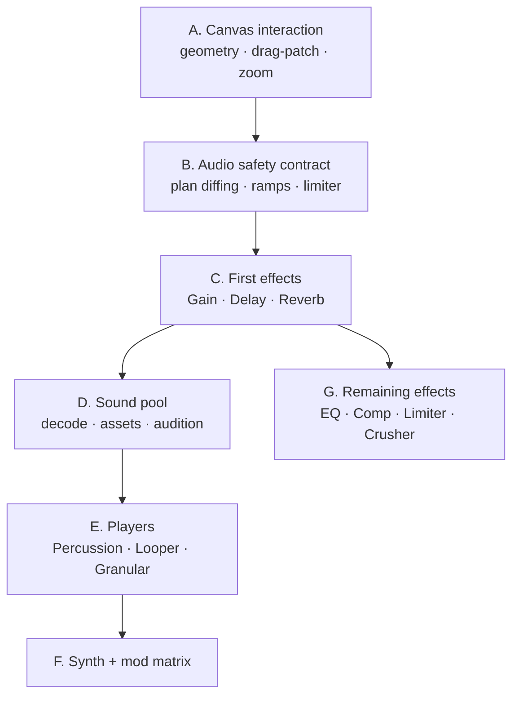

# Salvage Plan — Modular AV Performance → idMLab

**Date:** 2026-08-03
**Source:** `~/Documents/GitHub/Modular AV Perforamnce` (3,490 lines JS, 11 tests, all passing)
**Target branch:** `modular`
**Status:** Stages A (part), B, C, D, E and G ported; F planned in
[MODULAR_SYNTH_PLAN.md](MODULAR_SYNTH_PLAN.md)

---

## Verdict

There is real value here, and it sits almost entirely in **DSP designs and canvas
interaction** — the two areas idMLab has deferred longest. There is also a
whole architectural layer that must **not** come across, because idMLab
already has a strictly better version of it.

The split is unusually clean:

| Layer | Verdict | Why |
| --- | --- | --- |
| Audio DSP (players, effects, synthetic buffers) | **Take the designs** | Maps 1:1 onto plan §9.1/§9.2, which are unimplemented |
| Canvas interaction (cable geometry, drag-patch, zoom) | **Take the technique** | Fixes three named open defects |
| Sound pool (drop, decode, audition) | **Take the shape** | Nothing equivalent exists |
| Transport / scheduler | **Leave** | idMLab's runtime is significantly better |
| Snapshot manager | **Leave** | Reads state out of the DOM |
| Window manager, app shell, globals | **Leave** | Contradicts the document-command architecture |

Nothing can be copied verbatim. It is untyped JS, built on a fixed
column/rack model with `window.*` singletons, whereas idMLab is strict
TypeScript over a node graph with injected seams. What ports is the *content* —
signal topologies, envelope shapes, coefficient choices, geometry maths — not
the files.

---

## What is worth taking

### 1. Six effect topologies — `src/audio/EffectNode.js` (260 lines)

Plan §9.2 lists the effect rack in priority order and none of it is built. This
covers most of the first four tiers:

| Node | What is worth keeping | Plan slot |
| --- | --- | --- |
| `ReverbNode` | Convolver + a **generated plate impulse response** (noise × exponential decay), so reverb works with no asset pipeline | §9.2 tier 2 |
| `DelayNode` | Delay + feedback loop + wet/dry, 2 s max | §9.2 tier 2 |
| `EQNode` | Serial lowshelf 200 Hz → peaking 1 kHz Q1 → highshelf 5 kHz | §9.2 tier 3 |
| `CompressorNode` | Threshold −24, knee 30, ratio 12, attack 3 ms, release 250 ms | §9.2 tier 3 |
| `LimiterNode` | Threshold −0.1, hard knee, ratio 20, attack 1 ms — the always-on master limiter §9.4 requires | §9.2 tier 3 |
| `BitCrusherNode` | WaveShaper quantisation curve + 8 kHz lowpass to tame decimation | §9.2 tier 4 |

The **generated impulse response** is the quiet win: it means a reverb module
can ship and be tested before any asset loading exists.

### 2. Four player engines — `src/audio/PlayerEngine.js` (696 lines)

Plan §9.1 items 6–9, none of them built:

- **Looper** with a time-stretch grain scheduler (grains re-triggered against a
  stretch factor so pitch and rate decouple).
- **Percussion** with **choke groups** — plan §9.1 names this explicitly. Both
  halves are here: the group broadcast on trigger, and a 20 ms exponential
  choke fade rather than a hard cut.
- **Granular** with grain-window envelope, position jitter, freeze, and
  auto-scan advance. The envelope shape (ramp 20% → hold → exponential release)
  is the part worth keeping.
- **Synth** with an **8 × 12 modulation matrix** — plan §9.1 item 9 says "full
  three-oscillator Synth Player and modulation matrix" and this is a worked
  design for it: sources LFO1, LFO2, AmpEnv, FilterEnv, Velocity, Note,
  ModWheel, Random; destinations three oscillator pitches and levels, filter
  cutoff and resonance, two LFO rates, pan, volume.

### 3. Synthetic instrument buffers — same file

`createSyntheticBuffer` generates kick (150→40 Hz pitch sweep, exponential
decay), snare (noise + 180 Hz body), hihat (noise + one-pole difference
highpass), and a four-note pad. Immediately useful: audible test material for
the audio graph with no samples on disk, which is what makes the Phase 6 gate
testable at all.

### 4. Cable geometry from measured ports — `src/ui/CanvasManager.js`

`renderConnections` reads each port's real `getBoundingClientRect`, converts
screen space to canvas space by dividing by zoom, and draws a cubic bezier
between the results. That is exactly **known limitation #7** in
`MODULAR_STATUS.md`: *"Cable endpoint placement is approximate and should be
derived from actual port geometry."*

### 5. Drag-to-patch — same file

`startCableDrag` → `drawTempCable` → `connectCableTo` → `cancelCableDrag`, with
two properties worth keeping: it can be started from **either** end (the temp
bezier flips its control points when dragging backwards from an input), and it
checks direction before connecting. This is `MODULAR_NEXT_STEPS.md` step 6,
which idMLab has pending.

### 6. Pointer-anchored zoom — same file

```js
panX = mouseX - (mouseX - panX) * (zoom / prevZoom);
```

The standard correct formula for zooming about the cursor, plus `preventDefault`
on wheel so the page never scrolls — the two things
`MODULAR_STATUS.md` limitation #1 says the zoom redesign needs. Also a nice
touch worth stealing: below 0.6 zoom the canvas gets a `non-interactive` class
so knobs cannot be nudged when they are too small to aim at.

### 7. Sound pool — `src/ui/SoundPoolManager.js` (230 lines)

Drag-and-drop, `decodeAudioData`, audition preview with stop, delete, and a
waveform thumbnail. idMLab has no asset handling at all, and plan §10
requires "stable asset IDs rather than filesystem paths" — this is the shape of
the UI that sits on top of that.

---

## What must not come across

**The transport and scheduler (`AudioManager.js`).** It is a main-thread
`setTimeout` loop over float seconds with a hardcoded 16-tick wrap, no tempo
map, no clock-skew tracking, no sounding-note shadow, and no stall recovery. M
Modular's runtime solved every one of those. Porting it would be a regression;
the player engines must be re-hosted on `ModularRuntime` instead.

**`SnapshotManager.js`.** It captures state with
`document.querySelectorAll('.fader-slider')` and recalls by writing values back
into DOM inputs and firing synthetic events. idMLab's whole architecture is
that state lives in the document and the UI is a projection of it. The morph
*concept* is already specified in plan §8.2; nothing here improves on it.

**Global singletons.** Every module ends with `window.X = X`, and the engines
reach back through `window.AudioManager` from inside `trigger()`. That coupling
has to be cut on the way in — the engines must receive their context.

**Three habits to fix while porting, not preserve:**

1. `gain.gain.value = x` direct assignment throughout the effects — the zipper
   noise problem. Every one becomes a scheduled ramp honouring the descriptor's
   `smoothing`.
2. `chokeActiveVoices` schedules the actual stop with `setTimeout(…, 30)` —
   main-thread timing on an audio event. Becomes `src.stop(time + 0.02)`.
3. A fresh `OscillatorNode` + `GainNode` graph per note, per grain, per hit. Fine
   at prototype density; needs voice pooling before it meets idMLab's
   allocation budget.

---

## Port plan

Sequenced so each stage lands something testable, and so the safety contract
exists before the rack grows.



### Stage A — Canvas interaction (no audio, immediate value)

**Status: two of three complete (2026-08-03).** Cable endpoints are measured from
real port geometry (`ui/portGeometry.ts`, with a `ResizeObserver` on node faces),
and wheel zoom has been redesigned — eased toward a target, delta-mode normalised,
with the dot grid painted inside the transform so it scales with the modules.
Drag-to-patch is still not implemented; click-to-patch remains the only way to
connect.

The only stage that needed nothing else first, and it closes three open defects.

1. Replace the approximate cable endpoints in `ModularApp` with measured port
   geometry, using a `ResizeObserver` on node faces so a resized node re-routes
   its cables.
2. Add drag-to-patch alongside the existing click-to-patch, keeping both:
   compatible-port highlighting from `connectionError`, escape to cancel, and
   drag from either end.
3. Redesign wheel zoom on the pointer-anchored formula, with `preventDefault`
   and the low-zoom non-interactive threshold.

**Done when:** cables terminate on their visible ports at every zoom level,
dragging patches a cable, and zoom anchors to the pointer without scrolling the
page. Needs real-browser coverage, per the existing gate.

### Stage B — The audio safety contract (before any rack)

**Status: complete (2026-08-03).** Implemented in `src/modular/audio/`, 71 tests.

| Requirement | Where | How it is held |
| --- | --- | --- |
| A parameter change never rebuilds topology | `audioPlan.ts` | Node state is split into `structure` (rebuilds) and `parameters` (ramps); `isTopologyChange` is false for any parameter-only diff |
| Crossfade then dispose | `transitions.ts`, `graphAdapter.ts` | Build silent → ramp both ways over 15 ms on the audio clock → disconnect and dispose after a 50 ms margin |
| No leaks | `graphAdapter.ts` | Every built node is tracked until disposed; twenty successive rebuilds leave exactly one alive |
| No direct `AudioParam.value` writes | `params.ts` | `rampParam` is the only writer; a source-scanning test fails the build on any `.value =` in the folder, and the detector itself is tested against known-bad input |
| Always-on master limiter | `masterChain.ts` | The AV prototype's coefficients, gain before limiter, not user-patchable |
| Voice pooling | `voicePool.ts` | Fixed capacity, lazy construction, oldest-note stealing; `constructed` never exceeds capacity |

Bypass is a level ramp rather than a disconnection, so a bypassed node stays
wired and can be switched back with no topology work; wet at zero keeps the DSP
alive, as §9.4 requires.

**Remaining:** the contract is proven against a fake factory. The first real
module (Stage C) is what proves it against Web Audio.

### Stage C — First effects

**Status: complete (2026-08-03), and it swallowed Stage G.** All seven
topologies came across at once, because they share one shell and splitting them
across two stages would have meant writing that shell twice.

| Piece | Where | Note |
| --- | --- | --- |
| Generated plate impulse, crush curve | `dsp.ts` | Deterministic from the project hash, so a rebuild renders the same tail |
| Gain, Delay, Reverb, EQ, Compressor, Limiter, Bit Crusher, Audio Output | `effects.ts` | One `EffectModule` shell; `level` is the adapter's crossfade handle |
| Descriptors and the structure/parameter declaration | `registry/audioModules.ts` | `AUDIO_STRUCTURE_PARAMS` is what the compiler reads |
| Document → `AudioPlan` | `compileAudioPlan.ts` | Only Audio Outputs reach the master chain |
| Context, master chain, adapter, routing | `audioEngine.ts` | Started from the toolbar's Audio button, inside the gesture |

Three things were changed rather than ported: the mix is equal-power instead of
`wet`/`1 − wet`, the crush curve is sized per quantisation step instead of a
flat 44,100 samples, and the reverb is left un-normalised so a longer decay is
not also a quieter one.

Two deliberate deviations from the original brief:

- **Bypass is a mute, not a pass-through.** `AudioGraphAdapter` takes a
  bypassed node's level to zero, and a module that opened its dry path to
  compensate would be fighting it. The pass-through an insert wants is `mix = 0`,
  which leaves the DSP running and costs two ramps.
- **`audio-in` is never `required`.** A required input is a compile error when
  nothing is patched in, which is the wrong reading for an idle effect — and
  with no sound source module yet it would stop the whole graph compiling.

**What Stage C cannot yet prove:** there is no audio *source*. The rack builds,
ramps, rebuilds and routes correctly, and it is verifiably silent. Stage E is
what makes it audible.

### Stage D — Sound pool and assets

**Status: complete (2026-08-03).**

| Piece | Where | Note |
| --- | --- | --- |
| Content-addressed ids | `assets.ts` | 64-bit hash of the bytes; the same file dropped twice is one asset |
| The library | `assets.ts` | `loaded` / `missing`, manifest round-trip, stable ordering |
| Waveform thumbnails | `waveform.ts` | Min/max per bucket, quantised to signed bytes so the manifest stays small |
| Decode | `decode.ts` | Hashes before decoding, because `decodeAudioData` detaches its input |
| Synthetic starter kit | `kit.ts` | Kick, snare, hihat, pad — deterministic, so the kit is the same every session |
| Audition | `audition.ts` | One at a time, faded rather than cut, through the master limiter |
| The panel | `ui/SoundPool.tsx` | Drop zone, thumbnails, preview, delete, missing state |

Plan §10's rule — *stable asset IDs rather than filesystem paths* — is met by
hashing the content rather than by minting an id. That is what makes the three
behaviours the prototype's filename-keyed pool could not have: dropping the same
file twice is one asset whatever it is called, a renamed file is the same sample
while an edited one is not, and **re-dropping a file after reopening a project
re-attaches it silently**, with no matching up by hand.

**The document stores the manifest, never the audio.** A `.mmod` is a patch, not
a sample library. Five samples cost about 16 KB of identity and thumbnails, and
an asset whose bytes are absent opens as a greyed row that still shows its
waveform and still saves — so sharing a project describes honestly what the
recipient needs rather than silently dropping it.

**`Save + samples` writes a `.mmodpack`** for when the project has to travel:
the same document with the audio appended raw, described in
`MODULAR_IMPLEMENTATION_PLAN.md` §10.2. The library keeps each file exactly as
it was dropped so it can be bundled; generated audio is recomputed from a
recipe string rather than stored. `Open` sniffs the magic bytes and takes either
format, and a bundle that omits audio it never had says so by name rather than
arriving with holes in it.

### Stage E — Players

**Status: complete (2026-08-03).**

| Piece | Where | Note |
| --- | --- | --- |
| Runtime → audio clock | `clockBridge.ts` | Runtime seconds mapped onto `AudioContext.currentTime`, EMA-smoothed, snapped hard across suspend/resume |
| Voices and choke groups | `voices.ts` | A choke is scheduled on the audio clock, not fired on arrival, so a closed hi-hat cuts the open one at the right instant |
| Grains | `grains.ts` | 0.2 s lookahead, 40 ms wake — the same shape as the note scheduler, for the same reason |
| The three players | `players.ts` | Percussion, Looper, Granular over one `PlayerModule` base |
| Note routing | `noteAdapter.ts` | `PlayerNoteAdapter` samples both clocks once per batch rather than per note |
| The slot face | `ui/PercussionSlots.tsx` | Drag a sample from the sound pool onto a slot |

Two defects are worth remembering. Players had **no runtime processor at all** —
nothing converted note messages into scheduled events — which no unit test could
have caught, because every unit was correct. And `compileAudioPlan` carried only
numbers and booleans, so `slots` and `asset-id` were dropped silently and every
player was built with no samples; the guard test now asserts that every audio
parameter survives compilation.

**Not yet confirmed:** that the drums are audible end to end. The voice counter
increments; nobody has reported hearing them.

### Stage F — Synth and modulation matrix

**Status: planned in detail, one piece built.** The plan is
[MODULAR_SYNTH_PLAN.md](MODULAR_SYNTH_PLAN.md); the PWM generator is in
`dsp.ts` and the tuning library that will feed the oscillators is in
`src/modular/tuning/`.

Last, because it is the largest and because the 8 × 12 matrix wants the
parameter and preset contracts already settled. The matrix is also a natural
consumer of the control-tick rule from the Stream plan.

A second source joined it: the scale sequencer (`rjvaleo/scale-sequencer`)
contributes the voice — five wave types with true variable-width PWM, an
amplitude ADSR, a filter with its own ADSR and key follow. Its one-filter-for-
the-whole-instrument design does not come across, and the reason is instructive:
that shared filter is what makes its cutoff knob cancel the envelopes of notes
already scheduled.

### Stage G — Remaining effects

**Status: complete (2026-08-03), folded into Stage C.** See above.

---

## Relationship to the other plans

This did not reorder anything already agreed. `MODULAR_STREAM_PLAN.md` covers the
event domain; this covers the audio domain, which is Phase 6+ in the
implementation plan.

In the event, Stages B, C, D, E and G were all built ahead of the Stream parity
proof, because the safety contract is much cheaper to establish before there is a
rack to retrofit than after — which was the argument for writing this plan in the
first place.

## Open question

The source repo also has `timeline.html` and `visualizer.html` as separate
prototype pages, plus `ModularAudio_FuncSpec_v11.docx`. Those map to plan
Phases 8 and 9. I have not analysed them in depth because they are far past the
current horizon — worth a look only when Phase 8 comes up, and worth checking
then whether that spec is the same one that already fed
`MODULAR_IMPLEMENTATION_PLAN.md`.
