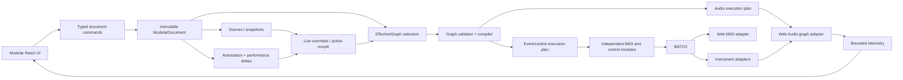
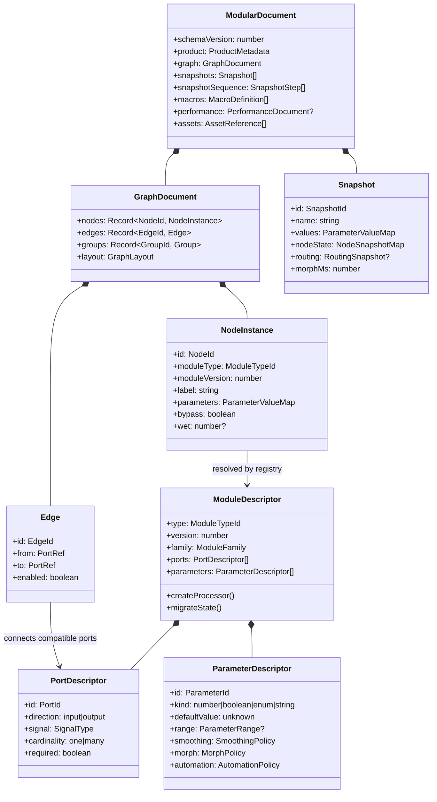
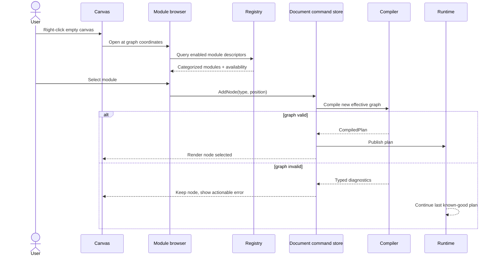
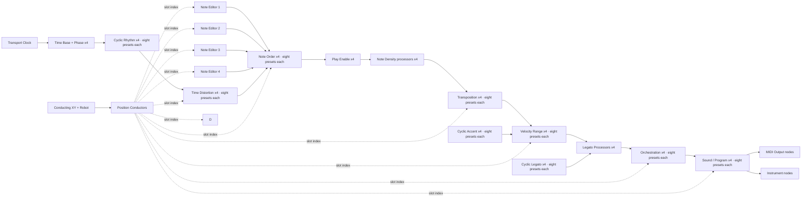
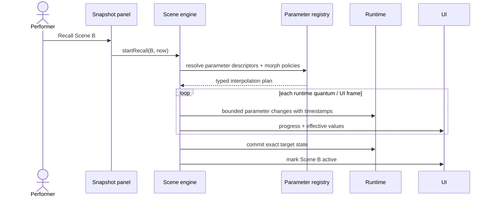

# M Modular Implementation Plan

**Planning baseline:** `master` at `dda067b` (`0.8.0-alpha`)
**Target branch:** `modular`, created from the clean `master` checkpoint
**Plan date:** 2026-08-02
**Status:** active implementation; see [`MODULAR_STATUS.md`](./MODULAR_STATUS.md) for the current checkpoint, verified baseline, known limitations, and ordered resume steps

## 1. Executive decision

Build M Modular as a new product with its own incompatible native format on a long-lived `modular` branch while leaving `master` as the current M Classic Web application. Reuse proven algorithms, transport concepts, event protocol ideas, MIDI adapters, and synth foundations where they fit, but give the new application its own graph model, state store, document format, UI, snapshots, and runtime contracts. Do not try to turn the existing `Unified.tsx` window canvas or monolithic Zustand store directly into a node graph.

The modular application should extract useful musical behaviors from the existing engine into independent processors from the beginning. Pattern generation, Note Order, Density, Transposition, Velocity, Time Distortion, Cyclic behavior, Orchestration, Conducting, MIDI I/O, and synthesis become separately instantiable modules. There is no fixed Voice count: a patch may contain zero, one, four, sixteen, or any practical number of module instances allowed by runtime resources.

The first releasable modular slice is a tasteful full-color, TouchDesigner-like canvas where a user can right-click to create typed MIDI/control modules, connect them, save the graph, and store/recall complete snapshots. Audio nodes, scene morphing, the automation timeline, live capture, and visual composition are staged after the graph and snapshot contracts are stable.

## 2. Source analysis and product interpretation

This plan reconciles four sources:

1. The current M Clone codebase and its documented Classic/Studio/Modular roadmap.
2. `ModularAudio_FuncSpec_v11 (1).docx`, which defines the modular audio, player, snapshot, mixer, performance, timeline, capture, and visualization product.
3. `UI_INTERACTION_TECHNICAL_SPEC.md`, which defines reusable state boundaries, interaction grammar, accessibility, persistence, traceability, and safe mutation patterns.
4. The product direction in the request: branch from `master`, preserve the existing MIDI application, make M functions independently pluggable, use right-click module creation, support MIDI/data and audio connections, take snapshots, and use a tasteful full-color visual system.

### 2.1 Resolved decisions

- **Classic remains intact as a separate product line.** `master` continues to be the Classic Web application. Modular can import a standard M project through a one-way translator, but it does not share Classic's runtime/document model and does not export Modular graphs back to Classic.
- **Standard M import builds a graph.** Import never creates a hidden compatibility engine. It decodes the source, instantiates ordinary Modular modules, wires them into the standard M signal flow, transfers supported state, and saves the result as a new Modular project.
- **The graph is not UI state.** Nodes, ports, edges, groups, parameters, macros, snapshots, and automation references are document/domain state. Selection, marquee, open menus, viewport pan, and transient wire dragging are page-local UI state.
- **One effective graph.** Every node face, snapshot, compiler, runtime, meter, export, and timeline surface reads the same effective graph after document state, live parameter overrides, and active scene/morph state are applied.
- **Every module is its complete interface.** Operational controls, editors, preset slots, playheads, routing choices, and status displays live permanently on the node face. Nodes do not require inspectors, pop-up edit windows, tabs that switch between other instances, drawers, or collapsed advanced sections.
- **Typed connections.** MIDI/event, clock, control, audio, and telemetry are different port types. Invalid connections are rejected before runtime.
- **Module count is dynamic.** Product algorithms never assume four Voices or one instance of a module family. Resource budgets and UI layout are separate from graph semantics.
- **Full color is structural and semantic.** Module families, signal types, stream identity, activity, and state use a restrained coordinated palette. Neutral surfaces provide visual rest; saturated color is concentrated in headers, ports, cables, meters, selected controls, and live data rather than applied indiscriminately.
- **Browser prototype first.** Web Audio and Web MIDI remain the first adapters. The graph/document/compiler contracts must still obey the native real-time boundaries already defined in the repository.
- **Snapshots and the timeline share parameter identity.** Every automatable value has one stable `ParameterId`; snapshots, macros, automation, MIDI mapping, UI controls, and host automation must never invent separate identifiers.
- **A module face matches its stream cardinality.** A processor wired to one musical stream exposes one lane of controls. Classic screens that grouped four streams are unfolded into four independently wired module instances rather than carrying a fixed four-lane editor into an individual node. Each instance owns its own embedded a-h preset strip. Apply this rule to Density and to every later Classic multi-stream decomposition.

### 2.2 Important scope correction

The current checkout has a deterministic 960-PPQN musical timeline, transport continuity, Movie capture, and MIDI export. It does **not** yet have the editable automation Timeline Window described by the new functional specification. The implementation must preserve the existing timing and Movie behavior, then add the new initial-snapshot-plus-delta-stream timeline as a separate workstream. It should not claim that an editable timeline is already preserved.

### 2.3 Current baseline

- Branch is clean: `master...origin/master`.
- Branch point is commit `dda067b`.
- 62 test files and 758 tests pass.
- TypeScript type checking passes.
- `src/engine` is framework-independent and already separates deterministic planning from React.
- `EngineEvent`, `EventBatchV1`, and `OutputSink` are valuable portability seams.
- Web MIDI output and the Web Audio synth already consume explicit scheduled events.
- Existing project documents are defensive and versioned, but their v2 four-Voice shape is a reference only; the new application starts a separate schema.
- Snapshots are M-specific: they capture active Position indices and a limited set of Voice/Pattern controls, not arbitrary module parameters, routing, macros, or topology.
- `src/state/store.ts` is a large application store that mixes document state, transport state, MIDI input behavior, UI selection, snapshots, slideshows, recording, and synth settings.
- `src/ui/Unified.tsx` is a draggable window manager, not a port/edge graph canvas.
- Fixed-four assumptions exist in engine decoding, presets, UI iteration, snapshot inclusion, channel themes, and tests.

## 3. Product boundaries

### 3.1 Modular MVP

The MVP is complete when it supports:

- the `modular` branch and a distinct M Modular application identity;
- an infinite pan/zoom canvas inside a stable application shell;
- right-click module creation from a searchable categorized menu;
- node selection, movement, deletion, duplication, grouping, and undo/redo;
- complete always-exposed node faces for every imported Classic workflow; no operational control requires opening another window or inspector;
- typed MIDI/event, clock, and control ports with visible connection activity;
- individual Pattern, Note Order, Transposition, Density, Velocity, Time Distortion, Cyclic, Orchestration, MIDI input, MIDI output, and internal synth modules;
- deterministic graph compilation and execution;
- graph save/load in a new Modular document format;
- one-way import of a standard M project into an editable graph made from ordinary Modular modules;
- full-scene snapshot save/recall, initially instantaneous;
- full-color light/dark semantic themes;
- keyboard-accessible alternatives for every pointer gesture;
- behavioral reference tests for any reused planner, MIDI scheduling, transform, or synth algorithm.

### 3.2 Post-MVP product increments

- scene morphing and snapshot sequences;
- macros and Performance View;
- audio source/instrument nodes and stereo audio graph;
- audio effects, banks, wet/dry, bypass, sends, buses, mixer, and analyzer nodes;
- live audio capture into Players;
- initial-snapshot plus delta-stream performance recording;
- editable multi-pass automation Timeline Window;
- Visualizer Window and visual preset/composition engine;
- desktop/native and plug-in adapters.

### 3.3 Explicitly deferred from the browser prototype

Keep the functional spec's exclusions: DAW tempo sync, offline faster-than-real-time bounce, CV routing, audio paths beyond stereo, collaboration, mobile-specific layout, and strip-integrated SSL-style processors. Third-party plug-in hosting is also out of scope.

## 4. Branch and repository strategy

### 4.1 Branch creation gate

Run this only when implementation begins:

```bash
git switch master
git status --short --branch
git pull --ff-only
git switch -c modular
```

Before the first modular commit, record the baseline commit, test count, typecheck result, and document schema version in a branch-local status file. Do not merge unfinished modular scaffolding into `master`.

### 4.2 Code movement policy

Avoid a large initial directory move. First create new modular namespaces beside the current code and selectively import or extract stable engine functions. Once the Modular replacements are proven, delete branch-local Classic application surfaces that the new product no longer needs; this cleanup does not affect `master`.

Recommended top-level layout:

```text
src/
  engine/                     # existing shared deterministic M engine
  modular/
    model/                    # graph, ports, parameters, scenes, automation types
    registry/                 # module descriptors and factories
    compiler/                 # validation, scheduling plan, audio plan
    runtime/                  # event/control runtime and adapter orchestration
    modules/
      midi/                   # MIDI/event generators and processors
      control/                # clock, cyclic, macro, logic, mapping
      instruments/            # synth/sample/granular sources
      audio/                  # effects, bank, mixer, capture, analyzer
    document/                 # encode/decode/migrations
    state/                    # document commands and effective graph selectors
    ui/                       # shell, canvas, complete node faces, snapshots
  platform/
    webaudio/
    webmidi/
```

### 4.3 Integration policy

- Shared bug fixes may be cherry-picked when the same extracted utility still exists in both products, but neither branch is required to preserve the other's application contracts.
- Modular-only document, canvas, audio graph, and UI work stays on `modular`.
- Do not routinely merge `master` wholesale into `modular` after the product surfaces diverge; use intentional shared-engine backports.
- Maintain behavioral reference traces for extracted algorithms, not cross-product document compatibility tests.

## 5. Target architecture

### 5.1 System component diagram



### 5.2 Core domain class diagram



### 5.3 Signal types

Use a closed, versioned union in the first implementation. This is the union as
implemented in `src/modular/model/graph.ts`, which is the normative source:

```ts
type SignalType =
  | { kind: "transport"; resolution: 960 }
  | { kind: "step-clock" }
  | { kind: "reset" }
  | { kind: "pattern-data" }
  | { kind: "step-event" }
  | { kind: "note-event" }
  | { kind: "midi"; protocol: "midi1" }
  | { kind: "control"; value: "number" | "boolean" | "index"; polarity?: "uni" | "bi" }
  | { kind: "scene" }
  | { kind: "audio"; channels: 1 | 2 }
  | { kind: "telemetry"; schema: string };
```

Rules:

- exact matches connect directly;
- compatible conversion requires an explicit converter module. `compatibleSignals`
  is currently exact key equality, so near-miss pairs such as a unipolar control
  meeting a bipolar input are rejected with no converter available to bridge them.
  Converter modules and a "you need a converter here" diagnostic are required
  before the control-signal module family grows;
- output fan-out is allowed unless the descriptor forbids it;
- input fan-in is allowed only when the destination declares a merge policy;
- event/control cycles are rejected unless they cross an explicit Delay/Memory
  module that declares `feedbackBreak` with `minDelayTicks >= 1`. A zero-delay
  break is still an infinite loop, so the registry rejects the descriptor rather
  than letting the compiler accept the patch;
- audio feedback is rejected unless it crosses an explicit bounded Feedback/Delay
  module whose declared `maxGain` lies in `(0, 1]`;
- telemetry never feeds processing without an explicit telemetry-to-control converter.

### 5.4 Module registry

The registry is the source of truth for right-click menus, node creation, port rendering, complete node-face controls, serialization, migrations, snapshots, automation, help text, and runtime processor factories.

```ts
interface ModuleDefinition<State> {
  descriptor: ModuleDescriptor;
  createDefaultState(): State;
  validateState(value: unknown): ValidationResult<State>;
  migrateState(fromVersion: number, value: unknown): State;
  createEventProcessor?(context: EventProcessorContext): EventProcessor;
  compileAudio?(context: AudioCompileContext): AudioNodePlan;
}
```

No React component may privately define a parameter or port that is absent from the descriptor.

### 5.5 Graph compiler

Compilation occurs after document commands and before runtime publication:

1. Resolve every node through the registry.
2. Validate node state and parameter values.
3. Validate edge endpoints, direction, type, and cardinality.
4. Detect invalid cycles and unreachable required outputs. A rejected cycle names
   the concrete loop (`a -> b -> c -> a`) rather than reporting that one exists.
5. Topologically order event/control processors. Ordering uses a sorted ready
   set so the result depends only on the graph, never on object key iteration
   order — a golden trace must not change because nodes were created in a
   different session. Audio edges do not constrain event order.
6. Produce a bounded audio topology plan with explicit feedback breaks.
7. Compute deterministic processor seeds from project seed plus stable node IDs.
   Position and label are deliberately excluded: moving or renaming a node must
   not change its music.
8. Attach a per-node per-window event budget, so a runaway generator degrades
   itself instead of freezing the tab.
9. Publish an immutable compiled plan at a safe boundary, carrying a monotonic
   `generation` integer. The scheduling wake compares that one integer; it never
   re-reads or re-fingerprints the document.
10. Keep the last known-good plan running if a new edit fails validation, so a
    mistyped connection does not silence a performance.

Implemented in `src/modular/compiler/compileGraph.ts` (`compileGraph`, `PlanPublisher`).

### 5.6 Runtime boundary

- The UI issues typed document commands and parameter changes.
- The compiler produces immutable plans off the audio processing path.
- The event runtime consumes musical ticks and emits versioned packets.
- Web MIDI and instrument adapters consume packets; they do not read React/Zustand.
- Web Audio topology changes are applied with bounded crossfades where possible.
- Telemetry is rate-limited, timestamped, and lossy by design; it must never back-pressure sound.
- A native implementation can later replace the adapters without replacing the graph document or module contracts.

### 5.7 Time and clock model

Classic represented musical time as accumulated floating-point seconds and
derived ticks as an afterthought. With four hardwired voices that is invisible;
with N independently wired streams that must stay phase-locked for a whole
performance it is drift. The Modular rules are:

- **Integer ticks are the only canonical musical time**, at 960 PPQN. Every
  musical decision, scheduled event, phase offset, swing, and delay is a whole
  tick. A tick stays exact in a JS number for centuries of music.
- **Seconds are derived, never accumulated.** One `TempoMap` holds
  `(tick, seconds, bpm)` anchors; `tickToSeconds` is a single multiply from the
  nearest anchor. Two nodes asking for the same tick get bit-identical seconds.
- **A tempo change appends one anchor.** Everything already scheduled keeps the
  exact time it was given.
- **Pause, resume, and stall recovery shift one map**, not N cursors. Every node
  stays exactly in phase across the discontinuity for free.
- **Every step advance is clamped to at least one tick.** A user-wired control
  source can drive a time base to zero, and a zero-length step is an infinite
  loop in any window planner. The clamp keeps the runtime alive; the compiler
  separately reports the degenerate value.

The scheduling wake must not come from a main-thread timer. Browsers throttle
main-thread timers to once per second in a background tab, and the Modular
canvas blocks the main thread for as long as a layout pass takes. Drivers are
tried in order and each may fail:

1. **AudioWorklet** — counts render quanta on the audio thread. Immune to tab
   throttling and main-thread jank, locked to the clock the music plays on.
2. **Web Worker timer** — keeps running when a background tab throttles the
   main thread.
3. **Main-thread timer** — only when neither of the above can be constructed
   (no AudioWorklet, or a CSP that blocks blob workers).

Output alignment has exactly one answer, in `PresentationClock`. Web MIDI
timestamps live in the `performance.now()` domain while music is scheduled in
`AudioContext` time. `getOutputTimestamp()` pairs a context time with the moment
that frame *reaches the output*, so a map built from it already accounts for
output latency. Where the browser does not implement it, the fallback must add
`outputLatency` explicitly — pairing `currentTime` with a bare
`performance.now()` claims audio scheduled now is heard now, which fires MIDI
early against the internal synth by 10-40 ms and far more over Bluetooth. The
conversion tracks a least-squares line over a bounded window of samples rather
than re-anchoring per batch, because `getOutputTimestamp()` is quantized to the
render quantum and the two clocks genuinely run at different rates over a long
session. The user's MIDI latency control is a trim on top of a correct
alignment, never the mechanism that produces one.

Randomness is counter-based: every draw is a pure hash of
`(project seed, node id, stream name, tick, draw index)`. Nothing carries
between draws, so window boundaries, a recovered stall, a pause, or a re-plan
cannot change the performance — which is the precondition for the golden traces
in section 13 meaning anything.

Live parameter edits are scheduled, not sampled. The UI pushes typed edits into
a bounded coalescing queue and the runtime drains them at window boundaries;
each edit's effective tick comes from the parameter's own declared `morph`
policy, so a `step-end` parameter genuinely changes on the next step boundary
instead of landing wherever the next wake happened to fall.

The steady-state scheduling path allocates nothing: processors own mutable state
created at compile time, events come from a pool, and the pending queue is a
binary heap over a backing array that grows but never shrinks. Telemetry to the
UI goes through a bounded ring drained once per animation frame; reporting is
lossy by design and must never back-pressure the scheduler.

Panic tracks what is *sounding*, not what was scheduled. `SoundingNotes` records
notes as they are genuinely sent to a port, counting overlapping retriggers, so
panic releases exactly the right notes rather than relying on CC 123, which
plenty of hardware ignores. A device that disconnects mid-phrase is repaired
from the same shadow on reconnect.

Implemented in `src/modular/runtime/`: `time.ts`, `clock.ts`, `skew.ts`,
`rng.ts`, `eventqueue.ts`, `parameters.ts`, `scheduling.ts`.

## 6. Key interaction architecture

### 6.1 Application shell

Use a stable shell with:

- top project bar for New/Open/Import/Save, module search, theme, and help;
- central pan/zoom canvas;
- bottom status area for compile errors, CPU, MIDI/audio device state, and zoom;
- launchers for the later Timeline and Visualizer surfaces.

The node canvas pans and zooms. Project/file commands and platform status remain fixed; musical transport, snapshots, conducting, MIDI routing, note editing, and synthesis are graph nodes with complete visible faces.

### 6.2 Complete node-face contract

Every registered module must provide a deterministic face layout containing all of its operational interface:

- module label, user label, bypass/enable state where relevant, input ports, and output ports;
- every parameter control and its current value/unit;
- all eight a-h embedded preset cells and their compact summaries for every multi-view module;
- the full note grid and editing tools for every Note Editor instance;
- the full 16-step grids, ranges, lengths, and Position cells for Cyclic racks;
- playheads, meters, scopes, validation, and device/persistence status relevant to that node;
- all commands formerly hidden in a window or global/context menu, presented as visible labeled controls on the responsible node;
- keyboard focus and an accessible name for every control.

Operational UI must not depend on an inspector, modal editor, pop-up window, accordion, hover-only action, or a selector that repurposes one node face to edit another instance. Right-click remains reserved for creating nodes and document-level node operations such as duplicate/remove; it is not the only route to a musical function.

Nodes may be physically large. Canvas pan/zoom replaces Classic window opening, closing, stacking, and switching. At overview zoom, controls may become non-interactive visual miniatures, but their state remains visible; zooming to the documented interaction threshold reveals the same face rather than opening another surface. Group frames may organize nodes but may not hide or collapse their controls.

Single-stream Variable/Cyclic processors use one shared compact face size, control height, button size, section spacing, and eight-preset strip geometry. A module may use a larger `editor` layout only when its always-visible primary editor genuinely requires it (for example Note Editor's piano roll); utility nodes use the smaller utility class. Individual processor implementations may not invent per-module frame or control dimensions.

### 6.3 Right-click creation sequence



### 6.4 Connection behavior

- Drag from an output port to start a cable.
- Compatible target ports brighten in their assigned signal color, strengthen their outline, and expose a text label.
- Incompatible ports remain visible but cannot accept the drop; the reason is available on hover/focus.
- Releasing on empty canvas opens a filtered module browser showing modules with compatible inputs.
- Completing a connection is one undoable document command.
- `Escape` cancels wire creation.
- Keyboard users can choose **Connect from...** and **Connect to...** from node menus.
- Audio/MIDI/control identity is encoded by port shape and line pattern, not color alone.

### 6.5 State ownership

| State | Owner | Persistence |
| --- | --- | --- |
| Nodes, edges, groups, module values, labels | Modular document | Project file |
| Snapshots, morph policies, macros, automation | Modular document | Project file |
| Selected node, open menu, wire draft, marquee | Canvas/component state | None |
| Pan/zoom and panel layout | Workspace preferences | Versioned local storage |
| Theme and reduced-motion preference | Settings | Versioned local storage |
| Transport play/pause position | Runtime/session | Not saved as active playback |
| Compile diagnostics | Derived selector | Recomputed |
| Meter/scope data | Bounded telemetry | Not persisted unless recording |
| Performance delta stream | Performance document | Project or external performance file |

### 6.6 Full-color visual system

Define semantic tokens rather than page-specific color literals:

- neutral canvas, grid, surface-1/2/3, raised, border, strong-border, text, muted text, disabled text, and inverse text;
- stable signal-family colors for transport/clock, pattern data, note/event data, MIDI, control/modulation, scene data, audio, and telemetry;
- stable module-family accents for sources/editors, transforms, cyclic/control, routing/I/O, snapshots/performance, instruments, effects, mixers, and analyzers;
- user-editable stream/column identity colors that propagate through ports, cables, meters, Note Editor playheads, rack lane markers, MIDI lanes, Timeline lanes, and visualization scopes;
- semantic state colors for active, selected, focused, recording, bypassed, pending, warning, error, clipping, and unavailable.

Color rules:

- Use a restrained neutral canvas and mostly neutral control bodies so the graph can carry substantial color without becoming noisy.
- Concentrate stronger color in small, meaningful regions: node title accents, port cores, cable activity, selected Position cells, playheads, meters, and live scopes.
- A cable starts with its source stream color while its shape/line treatment continues to encode signal type.
- Module-family color and stream identity are different layers: family accents identify what a node does; lane/cable colors identify what is flowing through it.
- Preserve stable mappings across the entire application and project. Reconnecting a stream must not arbitrarily recolor it.
- Use color harmonies and bounded saturation rather than assigning a unique hue to every control.
- Both light and dark modes use the same semantic identities with mode-specific luminance/chroma adjustments.
- Color is never the only carrier of meaning; labels, port shapes, icons, position, line patterns, and accessible text remain present.

Verify base, hover, active, focus, selected, recording, disabled, bypassed, warning, error, cable-active, meter, and scope states in both modes.

## 7. Decomposing M into modules

### 7.1 Reuse strategy

Refactor from the inside out:

1. Identify pure musical functions in `src/engine` that are valuable in a graph.
2. Extract or adapt each function behind a narrow, dynamic processor interface.
3. Replace array-index/Voice-number ownership with stable node and stream IDs.
4. Give every stateful processor explicit serializable state instead of reading the Classic store.
5. Use reference traces to preserve the musical behavior worth carrying forward, without preserving the old application or document contract.

### 7.2 Port vocabulary for the Classic decomposition

Classic M's current planner combines pattern traversal, probability, pitch, velocity, timing, duration, and routing in one pass. Modular must make those boundaries explicit. The initial port vocabulary is:

| Port type | Payload | Typical producers | Typical consumers |
| --- | --- | --- | --- |
| `transport` | play state, BPM, position, PPQN, bar/beat, discontinuity | Transport Clock, external sync adapter | Time Base, metronome, recorder, timeline |
| `step-clock` | scheduled step pulse, nominal duration, tick, sequence | Time Base, Phase, Cyclic Rhythm, Time Distortion | Note Order Reader, Cyclic modules |
| `reset` | deterministic reset/sync event with tick | Transport, Sync, UI trigger, MIDI control | stateful readers, cyclic modules, RNG modules |
| `pattern-data` | immutable steps, rests, chords, scrambled material, length metadata | Note Editor / Pattern Source, Pattern Recorder | Note Order Reader |
| `step-event` | chosen step index, pitches/rest, onset, nominal duration, source identity | Note Order Reader | Density, pitch, velocity, legato processors |
| `note-event` | timestamped note-on/off or note with gate, pitch, velocity, provenance | Pattern transforms, MIDI decoder | routing, MIDI output, instruments, recorder |
| `midi` | raw or normalized MIDI messages with device/channel metadata | MIDI Input, event encoder | filters, Input Control, MIDI Output, monitor |
| `control<number>` | scalar value plus range, polarity, timestamp | conductor, macro, MIDI CC, cyclic module | any compatible parameter input |
| `control<boolean>` | gate/toggle state | UI, MIDI mapping, logic | play enable, bypass, record arm |
| `control<index>` | discrete slot or selection index | Position Conductor, Pattern Group, Snapshot trigger | eight-position modules, Note Editor / Pattern Source |
| `scene` | snapshot recall/store/hold/sequence command | Scene Trigger, Slideshow | snapshot service |
| `audio<1|2>` | mono/stereo audio bus | instruments, effects, inputs | effects, mixer, recorder, output |
| `telemetry<T>` | lossy bounded display/diagnostic data | every runtime processor | monitors, scopes, editor playheads |

Editor commands, document mutation, node selection, and file operations are not cable types. They use the typed document-command API.

### 7.3 Reusable single-stream, eight-position preset contract

Every independently wired musical processor is a **single-stream node**. Classic screens that grouped four voices are unfolded into four module instances. Each multi-view instance owns eight embedded Positions, a-h, along the bottom of its permanent face.

- A processor has one musical input path and one corresponding output path. Multiple streams use multiple module instances; no face contains unused fixed lanes.
- A multi-view processor owns eight Position slots containing that one module's complete value or editor state.
- The compact preset strip shows a-h with a value or miniature beneath each letter.
- Clicking recalls a Position. Shift-clicking overwrites that Position from the current live controls. A tooltip states the stored value/summary and both gestures.
- One optional slot-index input activates a-h so Pattern Group, conducting, snapshots, and automation can coordinate otherwise independent nodes.
- The detailed editor and the preset strip remain on the same node face. There is no separate preset module, rack window, or selector that edits another instance.
- Standard M import maps Classic a-f directly, initializes g-h from module defaults, and creates one processor instance per imported stream.

```ts
interface EmbeddedPresetModule<T> {
  readonly streamCardinality: 1;
  readonly presetSchema: PresetSchema<T>;
  readonly presets: readonly [T, T, T, T, T, T, T, T];
  readonly activePreset: 0 | 1 | 2 | 3 | 4 | 5 | 6 | 7;
}
```

### 7.4 Full Classic musical module catalog

#### Transport, time, and advance

| Module | Inputs | Outputs | Classic responsibility |
| --- | --- | --- | --- |
| **Transport Clock** | play, pause, stop, sync, tempo controls; optional external transport | `transport`, beat/bar telemetry | global Start/Stop/Pause/Sync, tempo, shared 960 PPQN position |
| **Time Base** | `transport`; numerator and denominator controls | `step-clock` | per-path Time Base; denominator `0/sa` delegates to Step Advance |
| **Phase / Start Offset** | `step-clock`, `reset`; phase control | delayed `step-clock` | per-path Phase before playback begins |
| **Sync Divider / Restart** | `transport`; ratio and direction controls | `reset`, derived `transport` | Classic Sync Ratio and restart relationships |
| **Manual Step Advance** | UI, key, mouse, or MIDI trigger; optional velocity | `step-clock`, advance telemetry | `sa`, individual/all keyboard step, Mouse Advance |
| **Tap Tempo** | tap trigger | tempo `control<number>` | tap-derived global tempo |
| **Metronome** | `transport`; enable/accent settings | click `audio<1>`, optional `midi` | audible metronome |
| **MIDI Clock Encoder** | `transport`; enable/ratio settings | MIDI Start/Clock/Stop | hardware clock output |

#### Pattern material, reading, and recording

| Module | Inputs | Outputs | Classic responsibility |
| --- | --- | --- | --- |
| **Note Editor / Pattern Source** | optional `step-clock` for playhead display; active-pattern `control<index>`; visible record/edit controls | `pattern-data`, edit/playhead telemetry | one independently placed note-entry node whose face permanently contains the complete piano roll, keyboards, tools, range/counter, a-h Pattern slots, size/output length, record modes, and Pattern/Edit commands |
| **Pattern Recorder** | `midi` or `note-event`, `transport`, record arm, edit range/counter | pattern write commands | Single/Chord/Build plus Insert/Replace/Overdub/Drum Machine recording |
| **Note Order** | `pattern-data`, `step-clock`, `reset`, optional preset index; visible Original/Cyclic/Utterly mix | `step-event`, cursor telemetry | one stream's traversal processor with eight embedded mix presets |
| **Pattern Command Processor** | `pattern-data`, region/command document action | updated `pattern-data` | scramble, swap Original/Scrambled, reverse, rotate, copy/paste, region commands; offline/document-time only |
| **Play Enable Gate** | `step-event` or `note-event`; enable control | same stream or silence | per-path Play Enable without stopping upstream clocks |
| **Note Density** | `note-event`, optional density `control<number>` and preset index; visible probability slider and seed | accepted `note-event`, rejected telemetry | one independently placeable deterministic probability gate with eight embedded density presets |

Every place where notes are entered is its own **Note Editor / Pattern Source** module instance. Its complete editor is the node face; there is no compact proxy, expandable editor, or selector for other Pattern Sources. Adding another melodic/percussion lane means adding another Note Editor instance. A Standard M import creates four instances, one for each original note-entry path. Their a-h Pattern slots may receive the same Pattern Group selection control so they change together without sharing an editor.

#### Classic Variables

Every row below is a single-stream node implementing `EmbeddedPresetModule<T>`. A Standard M import normally creates four instances per family—one in each translated stream. Additional streams use additional ordinary instances.

| Module | Position value | Inputs | Outputs | Notes |
| --- | --- | --- | --- | --- |
| **Note Order** | one `{original, cyclic, utterly}` value per preset | `pattern-data`, `step-clock`, `reset`, preset index | `step-event`, order telemetry | complete mix editor plus eight compact stored mix summaries |
| **Transposition** | one semitone/scale-degree value per preset | `note-event`, optional scale context/control, preset index | transposed `note-event` | one pitch editor plus eight embedded presets |
| **Note Density** | one probability per preset | `note-event`, optional density control and preset index | accepted `note-event`, rejected telemetry | one slider plus eight embedded presets on the same node |
| **Velocity Range** | one `{low, high}` range per preset | `note-event`, Accent control, preset index | velocity-shaped `note-event` | one range editor plus eight embedded presets |
| **Time Distortion** | one time map per preset | `step-clock`, `transport`, `reset`, preset index | warped `step-clock`, map telemetry | one complete map editor plus eight embedded map miniatures |
| **Orchestration** | one destination/channel set per preset | `note-event`, preset index | routed `note-event` | one 16-destination editor plus eight embedded presets |
| **Sound / Program Choice** | one instrument/program choice per preset | `note-event`, preset index | tagged `note-event`, MIDI program events | one sound editor plus eight embedded presets |

Recommended pipeline order is clock-domain processing first, then note-domain processing:

```text
Transport -> Time Base -> Phase -> Cyclic Rhythm -> Time Distortion
Each Note Editor source + its warped clock -> Note Order -> Play Enable
-> Note Density -> Transposition/Harmony -> Velocity Range <- Cyclic Accent
-> Legato <- Cyclic Legato -> Orchestration -> Sound/Program -> outputs
```

#### Cyclic Variables and Phrasing

All three registered types share one `CyclicSequenceCore` and the single-stream/eight-position face contract. There is no separate Cyclic Editor window.

| Module | Position value | Inputs | Outputs | Classic responsibility |
| --- | --- | --- | --- | --- |
| **Cyclic Accent** | one 16-step grid of fixed/ranged levels 0-4 per preset | `step-clock`, `reset`, preset index | Accent `control<number>`, telemetry | complete grid editor plus eight embedded grid miniatures |
| **Cyclic Legato** | one 16-step grid of fixed/ranged levels 0-4 per preset | `step-clock`, `reset`, preset index | Legato/gate multiplier, telemetry | M Phrasing for one stream; may exceed 100% and overlap notes |
| **Cyclic Rhythm** | one 16-step grid of fixed/ranged levels 0-4 per preset | `step-clock`, `reset`, preset index | duration multiplier/transformed clock | step timing multiplication with complete editor plus eight presets |
| **Legato Processor** | base legato multiplier | `note-event`, next-onset timing, Cyclic Legato control | duration-adjusted `note-event` | separates cyclic control generation from event duration application |
| **Cyclic Reset Trigger** | UI/MIDI/transport reset controls | `reset` | named reset command shared by selected cyclic modules |

#### Harmony, routing, and cross-lane utilities

| Module | Inputs | Outputs | Classic responsibility |
| --- | --- | --- | --- |
| **Scale Context** | root, scale, tuning, snap settings | scale-context control/data | global key/scale guardrail |
| **Scale Quantizer** | `note-event`, scale context | quantized `note-event` | Scale Snap |
| **Chord-Tone Quantizer** | `note-event`, scale/chord context | chord-targeted `note-event` | tonic-triad Chord Tones behavior; extensible later |
| **Cumulative Transpose** | multiple transpose controls or ordered note streams | per-lane accumulated controls/streams | Second-Order Transpose without hard-coded four lanes |
| **Event Splitter** | one `note-event` stream | many `note-event` streams | fan-out to instruments/MIDI/routing paths |
| **Event Merger** | many `note-event` streams | one deterministically ordered stream | explicit cross-lane merge |
| **Channel Mapper** | `note-event`; channel map | mapped `note-event` | channel reassignment independent of Orchestration presets |

### 7.5 Conducting and generic control modules

| Module | Inputs | Outputs | Classic responsibility |
| --- | --- | --- | --- |
| **Conducting XY Surface** | pointer/touch/MIDI X/Y | bipolar/unipolar X and Y controls, baton telemetry | six-by-six Conducting Grid and Baton |
| **Robot Conductor** | `transport`; range, direction, time-base settings | automated X/Y controls | bounded Robot movement |
| **Position Conductor** | X or Y control; direction; range | slot-index `control<index>` | Conducting Arrow behavior for any coordinated set of embedded-preset modules or Pattern Group |
| **Continuous Mapper** | X or Y control; curve/range/polarity | normalized scalar control | continuous Velocity/Legato conducting and future mappings |
| **Tempo Conductor** | X/Y control; tempo range | BPM control | conducted tempo |
| **MIDI CC Mapper** | `midi`; CC/channel/device selector | scalar/boolean/index control | controller-driven Conducting and generic parameter control |
| **Input Control Mapper** | `midi`; key map/profile | transport, advance, slot, scene, slideshow, tempo, time-base commands | Appendix B Input Control System |
| **Macro** | one scalar/boolean control; mapping definitions | multiple parameter overrides | generalized performance control beyond Classic arrows |
| **Logic / Compare / Switch** | controls/events | controls/events | reusable conditions, toggles, gates, and routing decisions |

### 7.6 MIDI input, output, monitoring, and capture modules

| Module | Inputs | Outputs | Classic responsibility |
| --- | --- | --- | --- |
| **MIDI Input** | selected browser/device port | normalized `midi`, device telemetry | live Web MIDI source |
| **Source Channel Filter** | `midi`; channel/all selector | filtered `midi` | per-path Source setting |
| **Input Use Router** | filtered `midi`; mode selector | Record, Control, Keyboard Transpose, Echo Map branches | per-path Use setting |
| **MIDI Note Decoder** | `midi` notes/sustain | `note-event`, chord/build state telemetry | turns MIDI performance into normalized events |
| **Echo / Thru Router** | `midi` or `note-event`; enable/map controls | routed `midi`/`note-event` | Echo-Thru-Orchestration and Echo Map |
| **Keyboard Transpose** | keyboard `note-event`; reference/root settings | transpose control | transpose-from-MIDI-keyboard |
| **Program / Channel Message** | program, bank, channel-mode controls | MIDI program/channel messages | program change and supported channel-mode output |
| **MIDI Output** | `midi` or encoded `note-event`; destination configuration | physical MIDI side effect, output telemetry | timestamped multi-port Web MIDI sink |
| **MIDI Event Monitor** | `midi` and/or `note-event` | bounded telemetry | current Midi View data source |
| **Movie / Performance Recorder** | `transport`, `note-event`, tempo changes | captured performance data, recorder telemetry | Movie arm/start/finish and deterministic event capture |
| **SMF Exporter** | completed performance data | format-1 `.mid` file | deterministic Movie export; document command/service, not a real-time cable processor |

MIDI Assignment is an editor for MIDI Input/Output node configuration and device resolution. It is not one global musical node.

### 7.7 Snapshots, Slideshows, and scene control

| Module/service | Inputs | Outputs | Classic responsibility |
| --- | --- | --- | --- |
| **Snapshot Store/Recall** | scene store/recall commands; scope | scene state changes, active-scene telemetry | A-Z snapshots, partial inclusion, current mark |
| **Hold / Do Transaction** | hold, include-control changes, do/cancel | deferred atomic scene command | Classic Hold/Do behavior |
| **Restore Point** | capture/restore commands | scene recall | Restore From Snapshot |
| **Snapshot Quantizer** | scene trigger, `transport`, division | quantized scene trigger | Snapshot quantization |
| **Slideshow Sequencer** | record/play/pause/stop/loop commands, scene/slot actions, `transport` | ordered quantized scene/control commands | nine Classic Slideshows |
| **Scene Trigger** | UI/MIDI/control index | `scene` command | generic external snapshot activation |

Snapshot state is owned by the document-level scene engine because it spans arbitrary nodes. The graph modules above generate and consume typed scene commands; they do not each maintain private copies of global snapshots.

### 7.8 Initial instrument and audio endpoint modules

| Module | Inputs | Outputs | Role |
| --- | --- | --- | --- |
| **Built-in Synth Instrument** | `note-event`, parameter controls | stereo audio, voice telemetry | extracted form of the current stream synth; unlimited graph instances subject to CPU |
| **Drum / Bass / Lead / Chord-Pad Instruments** | `note-event`, parameter controls | stereo audio, telemetry | planned role engines, each independently instantiable |
| **Audio Output / Master** | one or many stereo audio inputs | browser audio side effect, master telemetry | final protective output |
| **Audio Monitor / Analyzer** | audio | passthrough audio, waveform/spectrum telemetry | modular scope and future Visualizer source |

The broader Player and effect catalog remains in Section 9.

### 7.9 Complete Classic workflow coverage on node faces

There are no secondary editor windows in Modular. The importer replaces every Classic window workflow with one or more permanently visible node faces:

| Classic window/workflow | Modular nodes created or used | Controls that must remain exposed |
| --- | --- | --- |
| **Patterns** | four Note Editor / Pattern Source nodes plus Time Base, Phase, Play Enable, Source Channel, Input Use, Echo, Mouse/Step Advance, and Pattern Recorder nodes | note grids, keyboards, Pattern a-h cells, play enable, source/use/echo, mouse advance, chord/insert/drum modes, record state, output length, size, time base, phase, selection and edit counter |
| **Pattern Editor / Note Edit** | one complete Note Editor node per note-entry location | all drawing tools, region, eraser, plunger, scissors, audition, range, counter, resize, Original/Scrambled commands, copy/paste and Pattern/Edit commands; no selector for another editor |
| **Variables** | independent Note Order, Transposition, Density, Velocity Range, Time Distortion, Orchestration, and Sound Choice nodes per stream | one live editor and all a-h preset summaries on every instance, plus conducting/mark controls formerly shared by the four-lane window |
| **Cyclic Variables + Cyclic Editor** | independent Accent, Legato, and Rhythm nodes per stream | one complete 16-step grid, fixed/ranged levels, five-level value bank, length, all eight Positions, reset, conducting, and transfer operations on each instance |
| **Conducting** | Transport Clock, Conducting XY Surface, Robot Conductor, Position Conductors, Continuous Mappers, Tempo Conductor, Sync Divider, Metronome/MIDI Clock, and Movie Recorder nodes arranged together | Start/Stop/Pause/Sync, Baton/Grid, tempo/range, robot ranges/time base, arrows/directions, continuous Velocity/Legato, sync ratio, Movie and clock/metronome states |
| **Midi** | Orchestration Rack, Sound/Program Rack, MIDI Input, Source/Use/Echo routers, MIDI Output, and MIDI Event Monitor nodes | 4 x 16 routing, programs, device/port/channel assignment, latency, program base, controller assignments, Echo Map, output state and event history |
| **MIDI Assignment** | controls live directly on each MIDI Input/Output node | device selector, physical/logical channels, connection state, latency and controller configuration; no assignment pop-up |
| **Midi View** | MIDI Event Monitor node | all monitored streams, timestamp, Note On/Off fields, Follow, Clear, bounded history and stream connection ports |
| **Snapshot** | Snapshot Store/Recall, Hold/Do, Restore, Quantizer, Slideshow Sequencer, and Scene Trigger nodes arranged together | A-Z stores, partial inclusion, Edit/copy, Blink Everything, current mark, quantization, all nine slideshow record/play/pause/loop/stop controls |
| **Synth** | one complete instrument node per synth instance | oscillators, mixer, LFO, filter, envelopes, glide, velocity, enable/master, ports and meters; no shared synth selector |
| **Global and context menus** | visible controls on the responsible node; project commands remain on the fixed project bar | Pattern/Edit commands on Note Editor, embedded preset operations on each processor, harmony on Scale/Transpose nodes, Options on Transport/MIDI nodes, output controls on output nodes |

The imported Standard M patch is therefore the original workflow spatially unfolded onto one graph canvas. A user navigates by panning/zooming and following cables, not by opening, closing, stacking, or switching windows.

### 7.10 Standard M reference topology

The importer creates four Note Editor lanes and unfolds every Classic Variable/Cyclic family into four corresponding single-stream processor nodes with embedded eight-position preset strips. More lanes create more ordinary processor instances.



Where the current planner fuses two of these operations, extraction tests must first record the intermediate semantic contract and then prove that the wired reference topology produces the retained output trace.

### 7.11 Dynamic instances and starter templates

Every module instance is independent and addressed by a stable `NodeId`. A processor cannot use its array position as identity and cannot assume sibling modules exist. Adding or deleting a Pattern, transform, generator, or instrument changes only the graph document and compiled plan.

Starter templates may recreate useful M-like signal chains, such as four parallel Pattern pipelines feeding four MIDI channels, but templates create ordinary independent nodes. The standard M importer uses the same template builder, then fills it from the decoded source document. Templates and imported patches are conveniences, not a compatibility runtime or hidden compound engine. Users can immediately add, remove, reorder, or cross-connect any module.

### 7.12 Standard M import translation

Import is an explicit conversion operation:

```mermaid
sequenceDiagram
  actor User
  participant Importer as Standard M importer
  participant Decoder as Read-only M decoder
  participant Builder as Standard patch builder
  participant Registry as Module registry
  participant Validator as Graph validator
  participant Store as Modular document store

  User->>Importer: Import standard M file
  Importer->>Decoder: Decode and validate source
  Decoder-->>Importer: Normalized M project + warnings
  Importer->>Builder: Translate project into patch recipe
  Builder->>Registry: Instantiate ordinary module definitions
  Registry-->>Builder: Nodes with stable IDs and parameters
  Builder->>Validator: Validate translated graph
  alt complete or safely repaired
    Validator-->>Store: Commit new .mmod document atomically
    Store-->>User: Open editable Modular patch + import report
  else unsupported or unsafe
    Validator-->>User: Show actionable report; commit nothing
  end
```

Recommended mapping for each imported standard M project:

| Standard M concept | Modular result |
| --- | --- |
| Global tempo and transport | one Transport Clock module |
| Each Pattern/Voice path | an independent Pattern pipeline with stable node IDs |
| Pattern material and output length | one dedicated Note Editor / Pattern Source instance per imported path |
| Note Order | four independent Note Order nodes, each with eight embedded Positions and a full editor face |
| Transposition | four independent Transposition nodes, each with eight embedded Positions |
| Note Density | four independent Note Density slider processors, each with eight embedded density presets |
| Velocity/Accent | independent Velocity Range and Cyclic Accent nodes per stream, each with eight embedded Positions |
| Time Distortion | independent Time Distortion nodes per stream, each with eight embedded maps |
| Rhythm and Legato | independent Cyclic Rhythm and Cyclic Legato nodes plus Legato processors per stream |
| Orchestration/output channels | independent Orchestration nodes per stream plus MIDI Output nodes |
| Conducting Grid/Robot | Conductor control generator wired to translated targets |
| Pattern Group and Variable Positions | visible a-h controls and slot-index wiring on each independently wired module |
| Snapshots and Slideshows | Modular snapshots and snapshot sequences, with a per-item import report |
| Built-in synth settings | independent Synth instrument modules connected to the matching event paths |
| MIDI assignments | Modular MIDI Input/Output module configuration where devices can be resolved |

The translator assigns stable IDs deterministically from source identities so repeated imports of the same file produce structurally comparable graphs. Unsupported source controls are never silently dropped: they appear in the import report and, when preserving raw data is useful, in disabled annotation/placeholder nodes. The source file remains unchanged.

## 8. Snapshots, macros, morphing, and automation

### 8.1 Generic snapshot model

Do not extend the current M-specific `Snapshot` type until it becomes a generic bag. Introduce a modular scene model with stable parameter paths:

```ts
type ParameterAddress = `${NodeId}:${ParameterId}`;

type ModularSnapshot = {
  id: SnapshotId;
  name: string;
  capturedAt: string;
  parameters: Record<ParameterAddress, ParameterValue>;
  nodeState: Record<NodeId, { bypass?: boolean; wet?: number }>;
  routing?: RoutingSnapshot;
  macros: Record<MacroId, number | boolean>;
  morphMs: number;
  exclusions: ParameterAddress[];
};
```

Topology capture should be optional per scene. The default MVP snapshot captures every module parameter, bypass/wet state, macro value, and routing enable state, but does not create/delete nodes during recall. Full topology scenes arrive only after click-free topology transition rules exist.

### 8.2 Morph policies

Every parameter descriptor declares one policy:

- `linear`, `exponential`, or `logarithmic` interpolation;
- `step-start`, `step-mid`, or `step-end` for enums/booleans;
- `crossfade` for compatible audio topology changes;
- `excluded` for unsafe/non-musical parameters;
- `immediate` for values that must jump.

### 8.3 Snapshot recall sequence



Interruption starts a new morph from the current effective values, not from the previous scene's original values. Reverse recall uses the same rule.

### 8.4 Macros

A macro mapping stores parameter address, min/max, curve, and polarity. Macro evaluation produces effective parameter overrides; it does not rewrite the saved base value on every frame. Snapshot capture resolves the audible/effective value and records macro positions separately.

### 8.5 Performance capture and timeline

Add this only after stable parameter IDs and generic snapshots exist:

```text
Initial complete modular snapshot
        +
timestamped parameter/transport/routing delta layers
        +
optional master audio and incoming audio references
        =
reconstructable performance document
```

The Timeline Window is a view/editor over this data. Scrubbing evaluates the initial snapshot plus ordered, enabled delta layers at a musical position. Overdub appends a layer; overwrite is an explicit destructive range command with confirmation. Soft takeover belongs in the parameter input adapter, not inside individual node UIs.

## 9. Audio modular workstream

### 9.1 Browser audio topology

Start with stereo only. Each audio-capable node compiles to a Web Audio plan. The graph compiler validates topology before the adapter constructs or reconnects nodes.

Minimum source/instrument order:

1. existing built-in synth DSP ideas adapted to the new instrument contract;
2. simple drum sample player;
3. monophonic bass;
4. lead;
5. polyphonic chord/pad;
6. Looper Player;
7. Percussion One-Shot with choke groups;
8. Granular Player;
9. full three-oscillator Synth Player and modulation matrix.

### 9.2 Effect node order

Prioritize a useful, testable rack before implementing all v1 modules:

1. Gain/Utility, Mixer, Send, Return, Master Output;
2. Delay and Reverb;
3. Filter/EQ and Compressor/Limiter;
4. Saturation and Smooth Crusher;
5. Chorus/Flanger/Phaser and Stereo Widener;
6. Pitch Shifter/Harmonizer;
7. Granular Processor;
8. Spectral Freeze/Shimmer;
9. Spectrum Analyzer.

Every processor node includes stable parameters, wet/dry, bypass, smoothing, serialization, and bounded telemetry. Analyzer nodes pass audio unchanged.

### 9.3 Banks and patching

Implement banks as explicit graph compounds, not as a special hidden audio engine:

- a bank has a nested graph, master in/out, dry tap, wet tap, per-slot ports, wet/dry, and bypass;
- Serial and Parallel modes generate visible internal connections that can be expanded;
- per-node Collapse to Master / Individual Out / Individual + Master are routing presets;
- free patch routing edits the same nested graph document;
- feedback requires an explicit bounded Feedback module.

### 9.4 Audio lifecycle and safety

- `Stop` halts new source events while tails continue.
- `Pause` silences/freezes immediately according to module policy.
- `Panic` cancels events, clears held notes, and bounds feedback.
- Bypass is click-free and may suspend DSP after transition.
- Wet at zero keeps processing alive; bypass does not.
- Asset decoding and graph compilation occur away from audio processing.
- The browser implementation documents where Web Audio cannot provide native-grade guarantees.

## 10. Document format and migration

### 10.1 Recommended envelope

Use a new Modular format and start its schema at version 1. A distinct `.mmod` extension makes the incompatibility obvious:

```ts
type ModularDocumentV1 = {
  format: "m-modular";
  schemaVersion: 1;
  product: "modular";
  capabilities: string[];
  graph: GraphDocument;
  snapshots: ModularSnapshot[];
  macros: MacroDefinition[];
  performance?: PerformanceDocument;
  assets: AssetReference[];
};
```

The modular branch must:

- write and read its own v1 document without depending on Classic runtime state;
- migrate future Modular schema and module versions explicitly;
- retain unknown nodes as disabled placeholders with their raw state and an actionable message;
- version each module state independently from the document envelope;
- use stable asset IDs rather than filesystem paths;
- distinguish per-machine workspace preferences from portable project state.

The Standard M importer is a boundary adapter, not native document compatibility. It may reuse the current defensive decoder in read-only mode, but its only output is a newly validated Modular graph. Modular export back to the standard M format is not supported because arbitrary graphs cannot be represented faithfully. Other interchange happens through neutral exports such as MIDI and audio.

## 11. Command, undo, and validation model

All graph mutations are typed commands:

```ts
type GraphCommand =
  | AddNode
  | RemoveNodes
  | MoveNodes
  | SetParameter
  | AddEdge
  | RemoveEdge
  | GroupNodes
  | UngroupNodes
  | RenameEntity
  | ApplySnapshot
  | SetMacroMapping;
```

- Commands return an inverse command or before/after patch.
- Undo/redo is bounded and document-local.
- Continuous knob/drag input coalesces into one undo entry.
- Compile failure does not discard the edit; it marks the graph invalid and preserves the last known-good runtime plan.
- Destructive node/column removal confirms when it removes content or breaks downstream paths.
- Asset creation/capture is not deleted by undo; only references are restored.

## 12. Implementation phases and gates

### Phase 0 — Freeze the Classic baseline and create the branch

Deliverables:

- create `modular` from clean `master` at the recorded commit;
- add branch-local product/status documentation;
- keep the 758-test and typecheck baseline green;
- record a small set of behavioral reference traces for algorithms selected for reuse.

Gate: no product code changes before the branch point and baseline are recorded.

### Phase 1 — Extract stable shared contracts

Deliverables:

- stable `NodeId`, `PortId`, `ParameterId`, musical packet, and processor contracts;
- eliminate fixed Voice counts from extracted code; module instances and stream identity use stable IDs;
- parameter descriptor contract with normalization, display, smoothing, morph, and automation policies;
- adapter tests proving extracted MIDI scheduling and synth behavior meet the new contracts.

Gate: selected seeded reference traces remain musically identical where preservation is intentional; new dynamic-instance tests pass with varying module counts.

### Phase 2 — Graph model, registry, compiler, and Modular document v1

Deliverables:

- immutable graph types and typed commands;
- module registry and state migration;
- edge/type/cardinality/cycle validation;
- event/control compilation;
- `.mmod` v1 encoder/decoder;
- standard-patch builder and importer transaction/report contracts;
- last-known-good compiled plan behavior.

Gate: property tests for graph invariants, deterministic compilation, round-trip serialization, and corrupted-document recovery.

### Phase 3 — Full-color shell and canvas

Deliverables:

- fixed shell plus pan/zoom canvas;
- right-click module browser;
- node shells, ports, wires, selection, group, duplicate, delete, undo/redo;
- descriptor-driven complete node faces with every operational control rendered in place;
- keyboard connection workflow and accessible menus;
- semantic full-color tokens, coordinated light/dark palettes, persistent stream colors, and reduced motion.

Gate: browser tests for pointer, keyboard, resize, zoom, menu clamping, invalid wiring, focus restoration, and narrow layouts. A node-face inventory test fails if a registered parameter, command, preset cell, port, or required status field lacks a visible accessible control.

Known interaction follow-up (recorded 2026-08-02): wheel zoom is usable enough to continue development but its interaction with viewport scroll/pointer anchoring is not yet correct. Revisit it before the Phase 3 gate and add a real-browser regression covering trackpad and mouse-wheel input at zoom limits and while the viewport is already panned.

### Phase 4 — MIDI modular MVP

Deliverables:

- complete Note Editor instances; single-stream/eight-position Note Order, Transposition, Density, Velocity, Time Distortion, Cyclic, Orchestration, and Sound/Program nodes; Conducting, Snapshot/Slideshow, MIDI I/O/Monitor, Merge/Split, and Synth nodes;
- connection activity telemetry;
- deterministic execution and panic/stop behavior;
- starter templates built from ordinary independent nodes;
- Standard M importer that converts supported projects into the same ordinary nodes and connections.

Gate: reference patches with 1, 4, 8, and 16 parallel pipelines produce specified deterministic event traces without any fixed-four logic. Imported standard fixtures produce the expected graph topology, parameters, snapshots, warnings, and musical trace, then save/reopen as `.mmod` without consulting the source file.

Timing gate. Phase 4 does not close on functional correctness alone; all of the
following must be measured, not asserted:

| Property | Threshold | How it is measured |
| --- | --- | --- |
| Window independence | byte-identical traces | plan the same span at 20 ms, 250 ms, and one whole-span window |
| Note onset error | p99 < 1 ms vs ideal tick time | scripted canvas pan/zoom and knob drags throughout the run |
| Dropped windows | zero | 30-minute soak with continuous UI interaction |
| Accumulated drift | < 1 ms over 30 minutes | transport position against wall clock |
| Hot-loop allocation | zero in steady state | `EventPool.created` flat across windows |
| MIDI vs internal synth | within ±2 ms | loopback port capture against rendered audio |

Window independence is the load-bearing one. If a scheduling boundary can change
the music, no other trace assertion in the suite means anything.

### Phase 5 — Generic snapshots, morphing, macros, Performance View

Deliverables:

- full modular snapshots and snapshot panel;
- parameter morph engine and interruption/reverse behavior;
- snapshot sequences;
- macro definitions/mappings;
- performance flags and simplified Performance View.

Gate: snapshot round-trip, exact final values, bounded morph error, boolean/enum policy tests, and audible click checks.

### Phase 6 — Audio foundation and role-specific instruments

Deliverables:

- stereo audio ports and Web Audio compiler adapter;
- mixer/master output, metering, mute/solo/pan/fader;
- four initial role instruments (drum, bass, lead, chord/pad), each instantiable any number of times;
- Delay/Reverb returns;
- asset registry and missing-asset states.

Gate: no graph edit can produce unbounded gain/feedback; click-safe lifecycle tests and long-session browser resource tests pass.

### Phase 7 — Players, effects, banks, and live capture

Deliverables:

- Looper, Percussion, Granular, and expanded Synth Players;
- prioritized effect suite;
- nested banks, serial/parallel presets, patch bay, wet/dry, bypass;
- inter-column routing equivalents as ordinary graph connections;
- live loop capture into stable asset IDs.

Gate: signal-flow reference projects pass audio routing, bypass, wet/dry, feedback safety, save/load, and missing-asset tests.

### Phase 8 — Performance capture and Timeline Window

Deliverables:

- initial snapshot plus timestamped delta layers;
- Data Only and Data + Master Audio recording;
- overdub and explicit overwrite;
- editable automation lanes, scrub reconstruction, copy/paste/move/loop/delete;
- soft takeover.

Gate: reconstruction is deterministic from the same project, seed, initial snapshot, and delta layers; scrub and playback resolve identical effective values.

### Phase 9 — Visualizer and AV render path

Deliverables:

- shared bounded telemetry/analysis streams;
- node/bank/input/output/master visualizations;
- detachable Visualizer surface;
- preset-driven visual composition;
- video capture/render integration when platform capability allows.

Gate: visual output consumes existing telemetry without altering musical/audio output or causing processing back-pressure.

### Phase 10 — Native readiness

Deliverables:

- native adapter proof using the same compiled graph and event protocol;
- audio-thread-safe immutable publication and bounded queues;
- device, sample-rate, buffer, sleep/wake, and host transport lifecycle specifications;
- Modular project and preset version matrix.

Gate: follow `NATIVE_PLUGIN_SPEC.md`; do not treat the browser prototype as native real-time certification.

## 13. Verification strategy

### 13.1 Test pyramid

- **Pure unit tests:** graph commands, type compatibility, cycle detection, parameter normalization, migrations, snapshot interpolation, macro curves, delta evaluation.
- **Golden musical traces:** seeded independent-node reference patches with 1, 4, 8, and 16 pipelines, plus irregular graphs that do not map to Voices. Every trace is asserted at three different lookahead settings and as one whole-span window; the results must be identical.
- **Compiler tests:** deterministic ordering, fan-in merge rules, disabled nodes, missing modules, invalid graphs, last-known-good publication.
- **Adapter tests:** Web MIDI lifecycle, Web Audio construction, cancellation, bypass, wet/dry, tails, panic, device loss. Panic and device loss are asserted against the sounding-note shadow, not against a CC 123 having been sent. Timestamp conversion is asserted on both the `getOutputTimestamp` path and the fallback path, which must agree.
- **Document fixtures:** every released Modular schema version plus corrupt, partial, and future/unknown-module fixtures; representative standard M import fixtures and expected translation reports.
- **React/browser tests:** right-click creation, keyboard creation, wire drag, keyboard connection, pan/zoom, focus, complete node-face controls, snapshots, themes, and original-workflow coverage.
- **Performance tests:** large graph compile time, UI frame time, telemetry bounds, long-session memory, dense event scheduling.
- **Manual audio checks:** clicks, tails, morphs, feedback bounds, meter latency, device suspend/resume.

### 13.2 Required continuous gates

Every phase ends with:

```text
focused red test
→ implementation
→ focused green
→ full test suite
→ coverage gate for graph/document/runtime core
→ typecheck
→ production build
→ saved browser verification project
```

Do not preserve 100% coverage by excluding new core modules. Keep graph model, compiler, document migrations, snapshot engine, and effective selectors fully covered.

## 14. Risks and mitigations

| Risk | Consequence | Mitigation |
| --- | --- | --- |
| Extracting useful M behavior into nodes | Musical drift or hidden fixed-four coupling | reference traces; explicit processor state; stable node IDs; reuse pure functions selectively |
| Reusing the old monolithic store | UI and runtime stay coupled | Build a new Modular document-command store; reuse algorithms, not Classic application state |
| Arbitrary feedback | Runaway audio or compile loops | Explicit delay/feedback-break modules and bounded gain |
| Port types are too loose | Invalid patches fail at runtime | Closed versioned union and compiler validation |
| Parameter IDs drift | Snapshots/macros/timeline become incompatible | Registry-owned stable IDs from the first node |
| Topology morphing too early | Clicks, lost state, unstable runtime | Parameter-only MVP morphs; topology scenes later |
| Fixed-four assumptions leak | Modular voice counts remain capped | capability-driven new APIs and 1/4/8/16 trace tests |
| Web Audio graph churn | Audible gaps and resource leaks | plan diffing, crossfades, disposal tests, last-known-good plan |
| Accumulated float time | Streams drift apart over a performance | integer ticks canonical; seconds derived from a tempo map, never accumulated |
| Main-thread scheduling | Music tears on canvas jank or in a background tab | AudioWorklet clock, worker fallback, adaptive lookahead |
| Sequential per-node RNG | Window boundaries and stalls change the music | counter-based draws keyed by tick; window-independence trace test |
| Allocation in the scheduling path | GC pauses appear as timing jitter | pooled events, heap queue, compile-time processor state, allocation budget test |
| Panic tracks scheduled notes | Stuck notes on hardware that ignores CC 123 | sounding-note shadow updated as messages are sent |
| User-authored graph topology | Zero-length steps and cycles hang the tab | one-tick minimum advance, per-node event budget, feedback breaks that must advance time |
| Long-lived branch diverges | Shared fixes become difficult | accept product divergence; cherry-pick only narrow utilities with local tests |
| Import becomes a hidden compatibility runtime | Modular architecture remains coupled to four-Voice state | one-way translation into ordinary nodes; discard source runtime after conversion |
| Standard controls cannot map exactly | Silent loss or misleading playback | explicit mapping policies, disabled placeholders where useful, and an import report |
| Full color becomes visually noisy | Dense node faces become harder to scan | neutral structural surfaces, stable semantic mappings, bounded saturation, and color concentrated on identity/state/data |
| Functional spec scope overwhelms MVP | No usable release | enforce the staged MVP/post-MVP boundary |
| Timeline is assumed to exist | Hidden product gap | track automation timeline as Phase 8 with its own acceptance gate |
| Compact-node conventions hide Classic controls | Workflow falls back into window/inspector navigation | complete-face registry contract and automated visible-control inventory |

## 15. Decisions required before their phases

These questions do not block Phases 0-4, but must be settled before the named work begins:

1. **Snapshot topology scope (Phase 5):** routing enable states only, or complete node/edge topology? This plan starts with routing states only.
2. **Modular file extension (Phase 2):** use the recommended concise `.mmod`, or a more explicit `.mmodular`? Standard M import remains a conversion regardless of the choice.
3. **Audio engine breadth (Phase 6):** finish the four Classic role engines before Looper/Granular/Percussion, as recommended, or prioritize the new functional spec's Players?
4. **Timeline/Visualizer surface model (Phase 8/9):** these new non-Classic workspaces may use dedicated canvases/routes, but they must not become hidden editors for musical node controls. All M-derived operational controls remain on graph node faces.

## 16. First implementation slice

The first code slice after branching should be deliberately small:

1. Add graph IDs, `SignalType`, `PortDescriptor`, `ParameterDescriptor`, `NodeInstance`, `Edge`, and `GraphDocument`.
2. Add pure `addNode`, `removeNodes`, `connect`, `disconnect`, and `setParameter` commands with inverses.
3. Add a registry containing three non-audio modules: Transport Clock, a full-face prototype Note Editor, and MIDI Output.
4. Add compiler validation and a deterministic event execution plan.
5. Add `.mmod` v1 graph round-trip serialization.
6. Add tests for valid patch, invalid port types, fan-out, cycle rejection, undo, corrupted document, and deterministic output.
7. Render the three-node graph in the semantic full-color canvas with right-click creation and no inspector dependency.
8. Only then extract the first production M-inspired processors into independent modules.
9. Add a minimal importer fixture that produces the same three-node graph through the standard-patch builder.

This slice proves the architectural spine without entangling the first milestone with instrument DSP, scene morphing, or the timeline.

## 17. Definition of success

M Modular succeeds when the best generative ideas in M have become independent, freely repeatable building blocks rather than a fixed four-Voice application. A user can create any practical number and arrangement of Pattern, transform, control, MIDI, instrument, effect, mixer, analyzer, snapshot, and automation modules—or import a standard M file and receive the complete familiar workflow spatially unfolded into those modules. Every original operational control is visible on the responsible node face; there are no editor windows or inspectors to open and no shared selectors that switch one editor between instances. The resulting patch can then grow beyond the source setup, store and morph complete performance states, and save as a deterministic Modular project. Classic remains stable on `master`, while `modular` is free to become a fundamentally different application.
