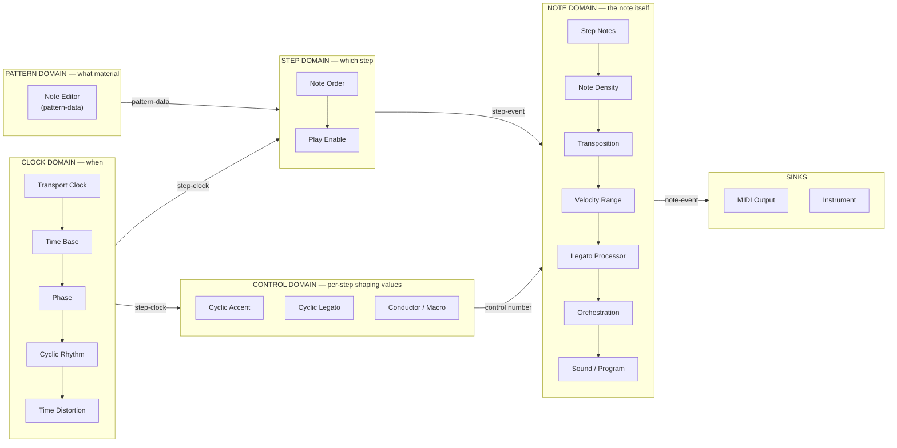
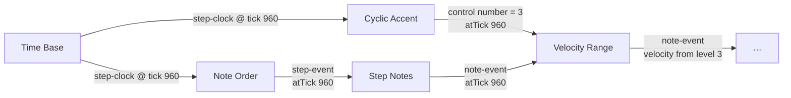
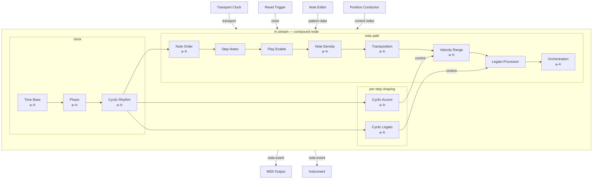
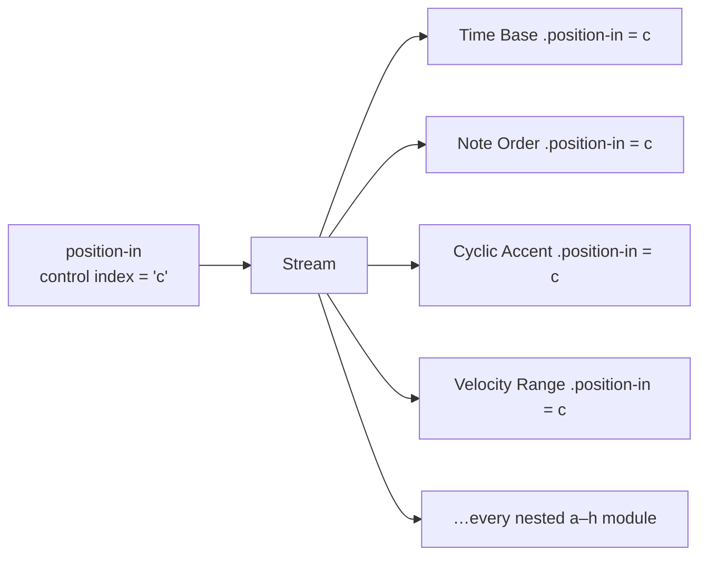

# M Modular — Module Map, Port Standard, and the Stream Compound

**Date:** 2026-08-02
**Branch:** `modular`
**Purpose:** settle three things before more modules are built — what a module *is*
in each signal domain, what ports and names it must use, and whether a complete
note should be assembled from loose parts or delivered as one compound.

---

## 1. Where the module build actually is

Eight of roughly forty catalogued modules are registered. What matters more than
the count is that they are unevenly distributed across the pipeline: the clock
and pattern domains are nearly done, the note-shaping domain is almost entirely
missing, and the control domain does not exist at all.

| Domain | Catalogued | Registered | Executing | Gap |
| --- | --- | --- | --- | --- |
| Transport / clock | 8 | 3 | 3 | Step Advance, Tap Tempo, Metronome, MIDI Clock Encoder, Sync Divider |
| Pattern material | 6 | 2 | 1 | Pattern Recorder, Pattern Command Processor, Play Enable Gate, Note Density is done |
| Classic Variables | 7 | 2 | 2 | Transposition, Velocity Range, Time Distortion, Orchestration, Sound/Program |
| Cyclic / phrasing | 5 | 0 | 0 | **all of it** — Accent, Legato, Rhythm, Legato Processor, Reset Trigger |
| Harmony / routing | 7 | 1 | 1 | Scale Context, Quantizers, Cumulative Transpose, Splitter, Merger, Channel Mapper |
| Conducting / scene | ~8 | 0 | 0 | all |
| Instruments / audio | ~20 | 0 | 0 | all |

The shape of that gap is the answer to your question about note-building versus
note-affecting. Everything registered so far either *creates* the note or
*passes it along*. Almost nothing that *shapes* it exists yet — and the shapers
are precisely the ones that need the cyclic step sequencers.

---

## 2. The five domains — what "note building" vs "note affecting" actually means

Read it as five questions, answered in order:

1. **Clock domain — when does a step happen?** Consumes `transport`, produces
   `step-clock`. Nothing here knows about pitch.
2. **Pattern domain — what material exists?** Produces `pattern-data`. This is
   state, not events; it is read by reference, not delivered on a cable.
3. **Step domain — which step fires?** Consumes `pattern-data` + `step-clock`,
   produces `step-event`. This is where traversal happens.
4. **Control domain — how should this step be shaped?** Consumes `step-clock`,
   produces `control<number>` values. **The cyclic sequencers live here.** They
   are not in the note path at all; they run alongside it on the same clock.
5. **Note domain — the note as a thing that will sound.** Consumes `step-event`
   (via the Step Notes converter) plus control values, produces `note-event`.

**A note is complete when it has all five answers.** Today the chain answers 1,
2, 3, and a hard-coded stub of 5 — velocity and gate are fixed parameters on
Step Notes. Domain 4 is empty, which is exactly why the notes all come out at
velocity 100 with a 90% gate.

---

## 3. Port naming — the drift, and the standard to fix it on

I dumped the live registry rather than trusting the source comments. The
inconsistencies are real and all of them are cheap to fix now and expensive
later, because port ids are serialized into `.mmod` documents.

### What is inconsistent today

| Problem | Where | Detail |
| --- | --- | --- |
| Step-clock input has two names | Note Editor uses `step-clock-in`; Phase and Note Order use `clock-in` | same signal, same role |
| Step-clock output never says "step" | Time Base and Phase both emit `clock-out` | asymmetric with `step-clock-in` |
| Reset cardinality disagrees | Time Base `many`, Phase `many`, **Note Order `one`** | reset is a bus; it must always be `many` |
| `required` is arbitrary | required on Time Base `transport-in`, Phase `clock-in`, Step Notes `steps-in`; **not** on Note Order `clock-in` or `pattern-in` | a Note Order with no clock silently does nothing |
| Fan-in with no merge policy | Step Notes, Density, MIDI Output all take `many` on their note input | §5.3 says fan-in requires a declared merge policy; no module declares one |
| Preset slot has two labels | Note Editor "Pattern position", everything else "Preset position" | same a–h concept |
| Preset storage has two names | Note Editor `pattern-presets`; everything else `preset-values` | breaks the shared preset contract |
| Telemetry outputs unmarked | `cursor-out`, `rejected-out`, `monitor-out` | nothing in the name says these are lossy and non-musical |
| Decorative ports | Step Notes `velocity-in` and `gate-in` exist but the processor ignores them | they read parameters only — the cables do nothing |

### The standard

| Role | Input id | Output id | Signal | Cardinality |
| --- | --- | --- | --- | --- |
| Transport | `transport-in` | `transport-out` | `transport` | in `one`, out `many` |
| Step clock | `clock-in` | `clock-out` | `step-clock` | in `one`, out `many` |
| Reset | `reset-in` | `reset-out` | `reset` | in **always `many`**, out `many` |
| Pattern material | `pattern-in` | `pattern-out` | `pattern-data` | in `one`, out `many` |
| Steps | `steps-in` | `steps-out` | `step-event` | in `one` unless merging, out `many` |
| Notes | `notes-in` | `notes-out` | `note-event` | in `one` unless merging, out `many` |
| Preset slot | `position-in` | — | `control<index>` | `one` |
| Modulation of a named parameter | `<parameter-id>-in` | — | `control<number>` | `one` |
| Shaping value produced per step | — | `<name>-out` | `control<number>` | `many` |
| Telemetry | — | `<name>-telemetry` | `telemetry<schema>` | `many` |

Three rules that go with it:

- **`required: true` means the module cannot do its job without it.** Note Order
  needs both `clock-in` and `pattern-in`. Density and MIDI Output do not — they
  are legitimately idle with nothing connected.
- **A `many` input must declare a merge policy** (`ordered-by-tick`,
  `first-wins`, `sum`) or be `one`. Only explicit mergers get free fan-in.
- **Every port whose name ends `-telemetry` is lossy and may never affect sound.**
  That makes the rule checkable in `validateModuleDescriptor` rather than a
  convention people remember.

Renaming touches serialized documents, so it needs a `moduleVersion` bump and a
migration per renamed port. That is why it should happen at eight modules and
not at thirty.

---

## 4. The thing that must be settled before any cyclic module is built

A cyclic sequencer emits one shaping value **per step**. A Velocity Range
downstream must apply *the value belonging to that step* to *the note derived
from that step*. Nothing in the signal contract currently says how those are
matched.

The rule, which needs writing into §5.3 of the plan:

> A `control` message carries the tick it applies to. A consumer matches control
> values to musical events **by tick**, never by arrival order or by "most
> recent value seen". A control value with no matching event is discarded; an
> event with no matching control value uses the parameter's current value.

Without this, a cyclic sequencer will be off by one step whenever a window
boundary falls between the control and the note, and the error will be
intermittent — the worst possible failure mode, and invisible to the
window-independence test unless the test covers the control path too.

The runtime already carries `atTick` on every message, so this is a contract and
a test, not a rewrite.

### Cyclic module shape

All three (Accent, Legato, Rhythm) share one core and one face contract:

| | |
| --- | --- |
| Inputs | `clock-in` (step-clock, required), `reset-in` (reset, many), `position-in` (control index) |
| Outputs | `<name>-out` (control number, many), `grid-telemetry` |
| State | 16-step grid of levels 0–4, each fixed or a range; position advances one per pulse |
| Presets | eight embedded a–h, each a complete 16-step grid |
| Reset | position returns to 0 |
| Pause | position **holds**; it is not a reset |

Cyclic Rhythm is the exception in one respect: it does not emit a control value,
it transforms the clock itself (`clock-in` → `clock-out`), because it changes
*when* the next step happens rather than how a note sounds. It belongs in the
clock domain, before Note Order.

---

## 5. The complete-note question

You are right that a note is not complete until the cyclic modules are wired,
and right that assembling one from eleven loose nodes every time is not a
workflow anyone wants. But there are two very different ways to fix that.

### Option A — a monolithic Note module

One big node with the step sequencers built into its face.

- Fastest to use, one drop and you have a working voice.
- **Recreates the thing this whole branch exists to escape.** The plan's success
  criterion is that M's ideas become "independent, freely repeatable building
  blocks rather than a fixed four-Voice application". A monolith with cyclics
  welded inside is a Voice with a different name — you cannot put Density before
  Transposition, cannot share one Cyclic Accent across three streams, cannot
  feed a conductor into just the legato.
- Its face would violate the complete-face rule or become an inspector.

### Option B — a **Stream** compound, which is what I recommend

The plan already has this mechanism and already committed to it for audio, in
§9.3: *"Implement banks as explicit graph compounds, not as a special hidden
audio engine — a bank has a nested graph … Serial and Parallel modes generate
visible internal connections that can be expanded."*

Apply exactly that policy to the event domain. A **Stream** is a node whose
insides are the ordinary modules, wired the standard way, and which can be
expanded onto the canvas at any time.

**Face of the compound:** four inputs (`transport-in`, `reset-in`,
`pattern-in`, `position-in`), one output (`notes-out`), plus telemetry. That is
the entire external surface — which is also why it composes: a Stream is
just another node to everything around it.

**Why this gets you what you asked for without the cost:**

- one drop builds the whole note package, cyclics included;
- every sub-module keeps its own eight embedded presets, exactly as specified;
- "Expand" drops the nested graph onto the canvas as ordinary nodes, so nothing
  is trapped inside;
- you can instantiate it any number of times — there is no fixed four anywhere;
- a Standard M import creates one per imported stream, which makes the importer
  dramatically simpler than wiring eleven nodes per voice;
- and anyone who wants Density before Transposition just expands it and rewires.

### Presets at two levels

This is the part worth being precise about, because it is easy to build the
wrong thing.

The compound's a–h strip is **not** a ninth copy of every nested preset. It is a
fan-out of `control<index>` to every nested module's `position-in`. Choosing
"c" on the Voice puts every sub-module on its own stored "c".

That is not a new mechanism — §7.4 already describes it for Note Editors: *"Their
a-h Pattern slots may receive the same Pattern Group selection control so they
change together without sharing an editor."* The compound just makes that wiring
implicit instead of manual.

If you later want a Stream preset that stores *different* slots per sub-module
(Time Base on "a" while Accent is on "d"), that is a Snapshot scoped to the
compound — Phase 5 work, and a genuinely different feature. Worth keeping the
two apart in our heads.

---

## 6. Recommended order

1. **Fix the port standard and rename** — 8 modules, migrations are small.
2. **Write the control-tick matching rule** into §5.3 plus a window-independence
   test that covers a control path, not just the note path.
3. **Build the cyclic core once**, then Accent, Legato, and Rhythm on top of it.
4. **Build the consumers**: Velocity Range and Legato Processor — until these
   exist the cyclics have nothing to talk to and cannot be verified musically.
5. **Add Play Enable and Transposition**, completing the note path.
6. **Then wrap it as the Stream compound**, once every part exists and is
   individually tested. Building the compound first would mean debugging eleven
   unproven modules through one face.
7. Wire the canvas to `ModularRuntime` so the Transport face actually plays.

Steps 1 and 2 are the ones that get more expensive every week they wait.

---

## 7. Open questions for you

1. ~~**Compound naming.**~~ **Decided: Stream** (`m.stream`). It matches the term
   the plan already uses for an independently wired path and carries none of
   Classic's fixed-four baggage. The implementation plan is in
   [MODULAR_STREAM_PLAN.md](MODULAR_STREAM_PLAN.md).
2. **Does Play Enable belong inside the compound or outside?** Inside is
   convenient; outside makes it usable as a mute for any note source.
3. **Should Step Notes stay a separate node inside the compound**, or should
   Note Order gain a `notes-out` directly? Keeping it separate is more honest
   about the type boundary but adds a node most users will never touch.
4. **Cyclic Rhythm in the clock domain** — confirm you agree it transforms the
   clock rather than emitting a control value. It changes Classic's behaviour
   subtly: rhythm multiplication becomes visible as clock warping.
