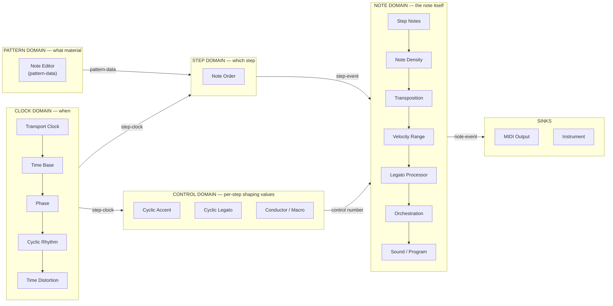
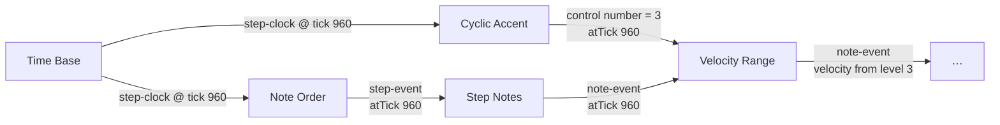
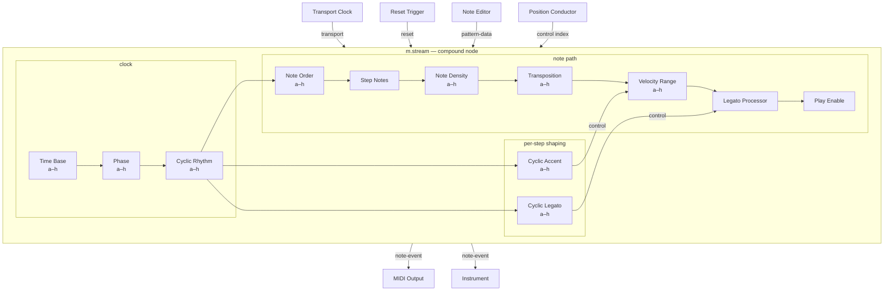
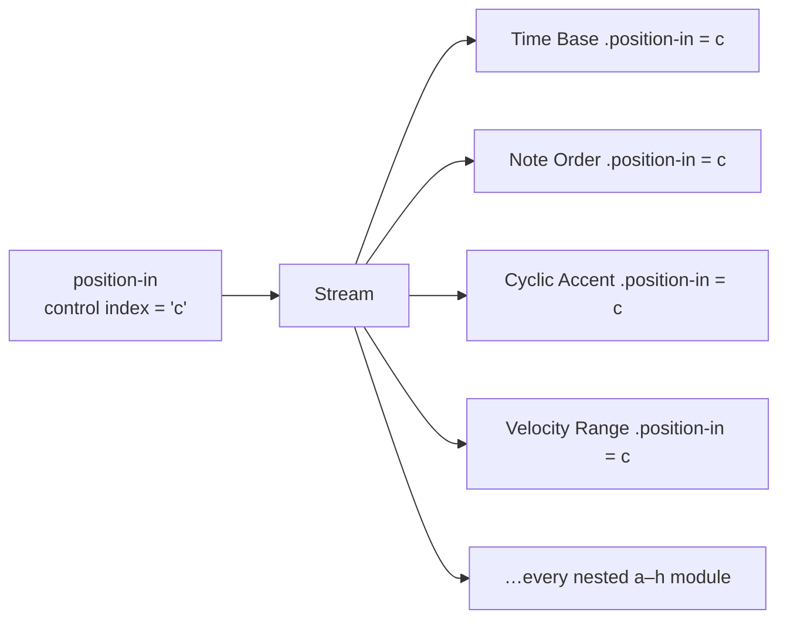

# idMLab — Module Map, Port Standard, and the Stream Compound

**Date:** 2026-08-02
**Branch:** `modular`
**Purpose:** settle three things before more modules are built — what a module *is*
in each signal domain, what ports and names it must use, and whether a complete
note should be assembled from loose parts or delivered as one compound.

---

## 1. Where the module build actually is

Sixteen of roughly forty catalogued module types are registered. Fourteen have
direct runtime processor factories; Note Editor supplies pattern state by
reference, and Stream materializes into the ordinary processors it contains.

| Domain | Registered | Runtime role | Principal remaining gap |
| --- | ---: | --- | --- |
| Transport / clock | 4 | Transport Clock, Time Base, Phase, and Cyclic Rhythm execute | Step Advance, Metronome, MIDI Clock Encoder, Sync Divider |
| Pattern / step | 3 | Note Order and Step Notes execute; Note Editor provides pattern state | Pattern Recorder and Pattern Command Processor |
| Per-step control | 2 | Cyclic Accent and Cyclic Legato execute | Reset Trigger and general control/macro sources |
| Note shaping | 5 | Density, Transposition, Velocity Range, Legato Processor, and Play Enable execute | Time Distortion, Orchestration, Sound/Program, Scale Context |
| Compound / output | 2 | Stream materializes; MIDI Output executes | Merger, Splitter, Channel Mapper, instruments/audio |
| Conducting / scene | 0 | — | snapshots, macros, conducting, slideshow |
| Instruments / audio | 0 | — | complete audio workstream |

The complete MIDI note-building spine now exists. The next architectural gap is
not another isolated processor: it is finishing the visible UI-to-runtime MIDI
session and telemetry, then proving that compact and expanded Streams are
behaviorally identical.

---

## 2. The five domains — what "note building" vs "note affecting" actually means

Read it as five questions, answered in order:

1. **Clock domain — when does a step happen?** Consumes `transport`, produces
   `step-clock`. Nothing here knows about pitch.
2. **Pattern domain — what material exists?** Produces `pattern-data`. This is
   state, not events; it is read by reference, not delivered on a cable.
3. **Step domain — which step fires?** Consumes `pattern-data` + `step-clock`,
   produces `step-event`. This is where traversal happens.
4. **Control domain — how should this step be shaped?** Consumes `step-clock`,
   produces `control<number>` values. **The cyclic sequencers live here.** They
   are not in the note path at all; they run alongside it on the same clock.
5. **Note domain — the note as a thing that will sound.** Consumes `step-event`
   (via the Step Notes converter) plus control values, produces `note-event`.

**A note is complete when it has all five answers.** The current canonical chain
answers all five: Cyclic Accent and Cyclic Legato emit tick-matched control,
Velocity Range and Legato Processor consume it, and Transposition, Density, and
Play Enable complete the note-shaping path before MIDI Output.

---

## 3. Port naming — implemented standard

The port standard below is now enforced by registry and graph validation.
Serialized v1 names migrate on decode to the v2 port and parameter vocabulary.
Many-input ports declare merge policies, telemetry names are validated, required
inputs are compiled as requirements, and Step Notes consumes `velocity-in` and
`gate-in` through the tick-matching control contract.

### The standard

| Role | Input id | Output id | Signal | Cardinality |
| --- | --- | --- | --- | --- |
| Transport | `transport-in` | `transport-out` | `transport` | in `one`, out `many` |
| Step clock | `clock-in` | `clock-out` | `step-clock` | in `one`, out `many` |
| Reset | `reset-in` | `reset-out` | `reset` | in **always `many`**, out `many` |
| Pattern material | `pattern-in` | `pattern-out` | `pattern-data` | in `one`, out `many` |
| Steps | `steps-in` | `steps-out` | `step-event` | in `one` unless merging, out `many` |
| Notes | `notes-in` | `notes-out` | `note-event` | in `one` unless merging, out `many` |
| Preset slot | `position-in` | — | `control<index>` | `one` |
| Modulation of a named parameter | `<parameter-id>-in` | — | `control<number>` | `one` |
| Shaping value produced per step | — | `<name>-out` | `control<number>` | `many` |
| Telemetry | — | `<name>-telemetry` | `telemetry<schema>` | `many` |

Three rules that go with it:

- **`required: true` means the module cannot do its job without it.** Note Order
  needs both `clock-in` and `pattern-in`. Density and MIDI Output do not — they
  are legitimately idle with nothing connected.
- **A `many` input must declare a merge policy** (`ordered-by-tick`,
  `first-wins`, `sum`) or be `one`. Only explicit mergers get free fan-in.
- **Every port whose name ends `-telemetry` is lossy and may never affect sound.**
  That makes the rule checkable in `validateModuleDescriptor` rather than a
  convention people remember.

The completed v1-to-v2 migration rewrites renamed parameter keys and edge port
references before the graph enters the runtime.

---

## 4. Control-tick contract

A cyclic sequencer emits one shaping value **per step**. A Velocity Range
downstream must apply *the value belonging to that step* to *the note derived
from that step*. Nothing in the signal contract currently says how those are
matched.

The implemented rule is:

> A `control` message carries the tick it applies to. A consumer matches control
> values to musical events **by tick**, never by arrival order or by "most
> recent value seen". A control value with no matching event is discarded; an
> event with no matching control value uses the parameter's current value.

Without this, a cyclic sequencer will be off by one step whenever a window
boundary falls between the control and the note, and the error will be
intermittent — the worst possible failure mode, and invisible to the
window-independence test unless the test covers the control path too.

The runtime carries `atTick` on every message, and deterministic tests cover
control values crossing scheduling-window boundaries.

### Cyclic module shape

All three (Accent, Legato, Rhythm) share one core and one face contract:

| | |
| --- | --- |
| Inputs | `clock-in` (step-clock, required), `reset-in` (reset, many), `position-in` (control index) |
| Outputs | `<name>-out` (control number, many), `grid-telemetry` |
| State | 16-step grid of levels 0–4, each fixed or a range; position advances one per pulse |
| Presets | sixteen embedded slots, each a complete 16-step grid |
| Reset | position returns to 0 |
| Pause | position **holds**; it is not a reset |

Cyclic Rhythm is the exception in one respect: it does not emit a control value,
it transforms the clock itself (`clock-in` → `clock-out`), because it changes
*when* the next step happens rather than how a note sounds. It belongs in the
clock domain, before Note Order.

**The face draws that state as sixteen vertical bars of five segments**, not as a
5 × 16 cell grid — the same information at a quarter of the height, which is what
lets the Pattern Editor stack three of them. Press a segment to set a step, drag
vertically for a random range (drawn hatched, so it is never mistaken for a fixed
level), drag sideways to paint. Clear / Flat / All random are a right-click menu
rather than a row of buttons, and clicking a number on the step ruler sets the
sequence length; steps past the end stay visible and dimmed.

---

## 5. The complete-note question

You are right that a note is not complete until the cyclic modules are wired,
and right that assembling one from eleven loose nodes every time is not a
workflow anyone wants. But there are two very different ways to fix that.

### Option A — a monolithic Note module

One big node with the step sequencers built into its face.

- Fastest to use, one drop and you have a working voice.
- **Recreates the thing this whole branch exists to escape.** The plan's success
  criterion is that M's ideas become "independent, freely repeatable building
  blocks rather than a fixed four-Voice application". A monolith with cyclics
  welded inside is a Voice with a different name — you cannot put Density before
  Transposition, cannot share one Cyclic Accent across three streams, cannot
  feed a conductor into just the legato.
- Its face would violate the complete-face rule or become an inspector.

### Option B — a **Stream** compound, which is what I recommend

The plan already has this mechanism and already committed to it for audio, in
§9.3: *"Implement banks as explicit graph compounds, not as a special hidden
audio engine — a bank has a nested graph … Serial and Parallel modes generate
visible internal connections that can be expanded."*

Apply exactly that policy to the event domain. A **Stream** is a node whose
insides are the ordinary modules, wired the standard way, and which can be
expanded onto the canvas at any time.

**Face of the compound:** four inputs (`transport-in`, `reset-in`,
`pattern-in`, `position-in`), one output (`notes-out`), plus telemetry. That is
the entire external surface — which is also why it composes: a Stream is
just another node to everything around it.

**Why this gets you what you asked for without the cost:**

- one drop builds the whole note package, cyclics included;
- every sub-module keeps its own sixteen embedded presets, exactly as specified;
- "Expand" drops the nested graph onto the canvas as ordinary nodes, so nothing
  is trapped inside;
- you can instantiate it any number of times — there is no fixed four anywhere;
- a Standard M import creates one per imported stream, which makes the importer
  dramatically simpler than wiring eleven nodes per voice;
- and anyone who wants Density before Transposition just expands it and rewires.

### The Pattern Editor: a second compound, deliberately unlike the first

`m.pattern-editor` merges Time Base, Phase, the three Cyclics, Note Editor, Note
Order, Step→Notes, Velocity Range, and Legato Processor. A clock goes in and
fully formed notes come out, with the accent already in their velocity and the
legato already in their length.

Two rules apply to every compound and are worth stating once:

1. **A module merged into a compound keeps its standalone form.** Note Editor
   still exists; so do Time Base, Phase, and all three Cyclics. Merging adds a
   way to work, it never removes one.
2. **A compound always takes a different name from its parts** — which is why the
   merged Note Editor is called the Pattern Editor rather than a bigger Note
   Editor.

Where it differs from the Stream: the Pattern Editor's embedded sequences have
**no preset pads of their own**. Individually they had a bank each, which meant a
stream carried five independent banks and no way to move between musical ideas as
a whole. Here one slot on the compound stores the entire idea — the pattern, all
three sequences, their separate lengths, the step rate, and the phase. It also has
no `Expand` command; it materializes at compile time only.

### Presets at two levels

This is the part worth being precise about, because it is easy to build the
wrong thing.

The compound's a–h strip is **not** a ninth copy of every nested preset. It is a
fan-out of `control<index>` to every nested module's `position-in`. Choosing
"c" on the Stream puts every sub-module on its own stored "c".

That is not a new mechanism — §7.4 already describes it for Note Editors: *"Their
a-h Pattern slots may receive the same Pattern Group selection control so they
change together without sharing an editor."* The compound just makes that wiring
implicit instead of manual.

If you later want a Stream preset that stores *different* slots per sub-module
(Time Base on "a" while Accent is on "d"), that is a Snapshot scoped to the
compound — Phase 5 work, and a genuinely different feature. Worth keeping the
two apart in our heads.

---

## 6. Completed Stream build order

1. **Fix the port standard and rename** — 8 modules, migrations are small.
2. **Write the control-tick matching rule** into §5.3 plus a window-independence
   test that covers a control path, not just the note path.
3. **Build the cyclic core once**, then Accent, Legato, and Rhythm on top of it.
4. **Build the consumers**: Velocity Range and Legato Processor — until these
   exist the cyclics have nothing to talk to and cannot be verified musically.
5. **Add Play Enable and Transposition**, completing the note path.
6. **Then wrap it as the Stream compound**, once every part exists and is
   individually tested. Building the compound first would mean debugging eleven
   unproven modules through one face.
7. Wire the canvas to `ModularRuntime` so the Transport face actually plays.

The seven-step foundation is implemented. The remaining Stream gate is a direct runtime
trace comparison between compact and expanded forms, followed by Stream-scoped
snapshot behavior. Current priorities are maintained in
[MODULAR_NEXT_STEPS.md](MODULAR_NEXT_STEPS.md).

---

## 7. Decisions resolved by the implementation

1. ~~**Compound naming.**~~ **Decided: Stream** (`m.stream`). It matches the term
   the plan already uses for an independently wired path and carries none of
   Classic's fixed-four baggage. The implementation plan is in
   [MODULAR_STREAM_PLAN.md](MODULAR_STREAM_PLAN.md).
2. **Play Enable is inside the compound**, after Legato Processor.
3. **Step Notes stays separate** to preserve the explicit step-to-note boundary.
4. **Cyclic Rhythm is in the clock domain** and transforms the clock rather than
   emitting a note-shaping control value.
