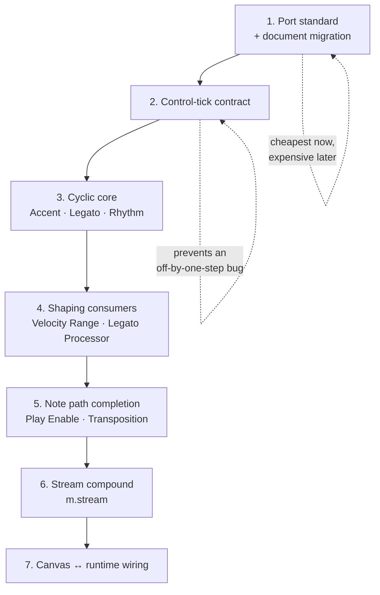
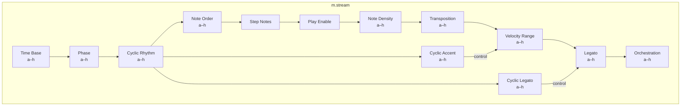
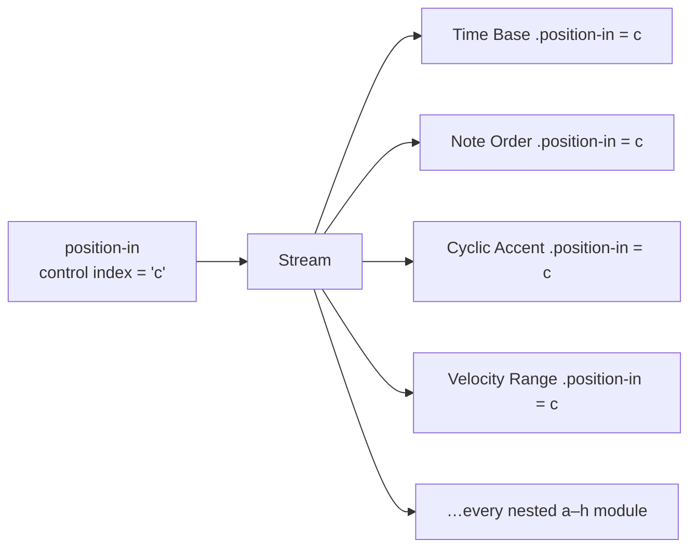

# M Modular — Stream Build Plan

**Date:** 2026-08-02
**Branch:** `modular`
**Status:** active; Stage 1 through Stage 7 completed, open items moved to later plan tracks
**Companion:** [MODULAR_MODULE_MAP.md](MODULAR_MODULE_MAP.md) explains the reasoning; this
document is the ordered work.

---

## Decision of record

A complete note is assembled by a compound node called a **Stream**
(`m.stream`), whose insides are ordinary modules wired the standard way and
which can be expanded onto the canvas at any time.

"Stream" was chosen over "Note Voice" deliberately: the plan already calls each
independently wired path a stream, and the word carries none of Classic's
fixed-four-Voice baggage. Nothing in the codebase should reintroduce the word
"Voice" for this concept.

The Stream is built **last**, after every module it contains exists and is
individually tested. A compound built over eleven unproven modules means
debugging all of them through one face.

---

## Phase order at a glance

Stages 1 and 2 get more expensive every week they wait: stage 1 because port ids
are serialized into `.mmod` documents and every new module adds migrations,
stage 2 because every cyclic module built without it inherits the same latent
timing defect.

---

## Stage 1 — Port standard and migration

Status: completed.

**Goal:** every module speaks the same port vocabulary before there are thirty of them.

### The standard

| Role | Input id | Output id | Signal | Cardinality |
| --- | --- | --- | --- | --- |
| Transport | `transport-in` | `transport-out` | `transport` | in `one`, out `many` |
| Step clock | `clock-in` | `clock-out` | `step-clock` | in `one`, out `many` |
| Reset | `reset-in` | `reset-out` | `reset` | in **always `many`**, out `many` |
| Pattern material | `pattern-in` | `pattern-out` | `pattern-data` | in `one`, out `many` |
| Steps | `steps-in` | `steps-out` | `step-event` | in `one` unless merging |
| Notes | `notes-in` | `notes-out` | `note-event` | in `one` unless merging |
| Preset slot | `position-in` | — | `control<index>` | `one` |
| Parameter modulation | `<parameter-id>-in` | — | `control<number>` | `one` |
| Per-step shaping value | — | `<name>-out` | `control<number>` | `many` |
| Telemetry | — | `<name>-telemetry` | `telemetry<schema>` | `many` |

### Renames

| Module | From | To |
| --- | --- | --- |
| `m.note-editor` | `step-clock-in` | `clock-in` |
| `m.note-editor` | parameter `pattern-presets` | `preset-values` |
| `m.note-editor` | port label "Pattern position" | "Preset position" |
| `m.note-order` | `cursor-out` | `cursor-telemetry` |
| `m.note-density` | `rejected-out` | `rejected-telemetry` |
| `m.midi-output` | `monitor-out` | `monitor-telemetry` |

### Cardinality and requirement corrections

| Module | Port | Change |
| --- | --- | --- |
| `m.note-order` | `reset-in` | `one` → `many` (reset is a bus) |
| `m.note-order` | `clock-in` | add `required: true` |
| `m.note-order` | `pattern-in` | add `required: true` |
| `m.step-to-notes` | `steps-in` | `many` → `one` until a merge policy exists |
| `m.note-density` | `notes-in` | `many` → `one` until a merge policy exists |
| `m.midi-output` | `notes-in` | keep `many`, declare merge policy `ordered-by-tick` |

### Also in this stage

- **Implement or remove the decorative ports.** `m.step-to-notes` declares
  `velocity-in` and `gate-in`, but `StepToNotesProcessor` reads parameters only,
  so those cables currently do nothing. Either wire them (they become the first
  consumers of the control-tick rule from stage 2) or drop them. Recommendation:
  keep them and wire them in stage 4, since Cyclic Accent will drive them.
- **Add `mergePolicy` to `PortDescriptor`**: `"ordered-by-tick" | "first-wins" | "sum"`.
- **Enforce in `validateModuleDescriptor`:** a `many` input without a
  `mergePolicy` is a descriptor error; a `telemetry` port whose id does not end
  `-telemetry` is a descriptor error; a non-telemetry port whose id *does* end
  `-telemetry` is a descriptor error.
- **Enforce in `validateGraph`:** a telemetry output may only connect to a
  telemetry input, so lossy data can never reach the note path.

### Migration

Every renamed port and parameter needs a `moduleVersion` bump plus a migration
that rewrites both the node's parameter keys and any edge referencing the old
port id. Documents written before this stage must open without losing cables.

### Done when

- the live registry dump shows one name per role across all modules;
- descriptor validation rejects each violation above, with a test per rule;
- a fixture `.mmod` written at the current `moduleVersion` opens with every cable
  intact and re-saves at the new version.

---

## Stage 2 — The control-tick contract

Status: completed.

**Goal:** a per-step shaping value lands on the note from *that* step, always.

### The rule, to be written into plan §5.3

> A `control` message carries the tick it applies to. A consumer matches control
> values to musical events **by tick**, never by arrival order and never by
> "most recent value seen". A control value with no matching event is discarded.
> An event with no matching control value uses the parameter's current value.

### Why it cannot wait

Without it, a cyclic sequencer is off by one step whenever a scheduling window
boundary falls between the control value and the note it belongs to. The failure
is intermittent, depends on machine load, and is invisible to the existing
window-independence test because that test only exercises the note path.

### Work

- `StreamMessage` already carries `atTick`, so no runtime rewrite is needed.
- Add a `ControlMatcher` helper: buffers control values by tick, hands a
  consumer the value for a given tick, and discards values whose tick has passed.
- Extend the window-independence test so a control path crosses window
  boundaries: assert identical traces at three lookaheads with a cyclic-style
  control source feeding a note-domain consumer.
- Add an explicit test that a control value arriving in an earlier window than
  its note still lands on the right note.

### Done when

- the rule is in the plan;
- a control-carrying chain produces byte-identical traces at 20 ms, 250 ms, and
  whole-span windows.

---

## Stage 3 — The cyclic core

Status: in progress.

Implemented in code:

- Shared cyclic sequence core used by Accent, Legato, and Rhythm runtime processors.
- `m.cyclic-accent`, `m.cyclic-legato`, and `m.cyclic-rhythm` registered with
  standardized clock/reset/position ports and telemetry naming.
- Deterministic ranged-cell resolution and cross-window determinism tests.
- Rhythm emits warped clock pulses from cyclic levels.

**Goal:** one shared sequencer core, three modules on top of it.

### Shared contract

| | |
| --- | --- |
| Inputs | `clock-in` (step-clock, **required**), `reset-in` (reset, many), `position-in` (control index) |
| Outputs | `<name>-out` (control number, many), `grid-telemetry` |
| State | 16-step grid of levels 0–4, each a fixed level or a range; position advances one per pulse |
| Presets | eight embedded a–h, each a complete 16-step grid |
| Layout | `editor` — the complete grid is always visible, no Cyclic Editor window |
| Reset | position returns to 0 |
| Pause | position **holds** — pausing is not a reset |
| Randomness | a ranged cell resolves with a counter-based draw keyed on the step tick |

### The three modules

| Module | Type id | Output | Domain |
| --- | --- | --- | --- |
| Cyclic Accent | `m.cyclic-accent` | `accent-out` (control number) | control |
| Cyclic Legato | `m.cyclic-legato` | `legato-out` (control number) | control |
| Cyclic Rhythm | `m.cyclic-rhythm` | **`clock-out` (step-clock)** | **clock** |

**Cyclic Rhythm is deliberately different.** It does not emit a shaping value; it
transforms the clock, because it changes *when* the next step happens rather
than how a note sounds. It sits in the clock domain between Phase and Note
Order. This makes Classic's rhythm multiplication visible as clock warping,
which is a small behavioural change worth confirming when we return to this.

### Done when

- one `CyclicSequenceCore` is shared by all three, with its own unit tests;
- ranged cells are deterministic and window-independent;
- Cyclic Rhythm's warped clock keeps Time Base's absolute-grid property, so two
  streams with identical settings stay in phase indefinitely.

---

## Stage 4 — The shaping consumers

Status: completed.

Implemented in code:

- `m.velocity-range` and `m.legato-processor` module descriptors and runtime processors.
- Tick-matched control consumption from `accent-in` and `legato-in`.
- Preset-position recall support via `position-in`.
- Tests for per-step velocity shaping and overlapping legato durations.

**Goal:** give the cyclics something to talk to. Until this stage they cannot be
verified musically, only structurally.

| Module | Type id | Inputs | Outputs | Presets |
| --- | --- | --- | --- | --- |
| Velocity Range | `m.velocity-range` | `notes-in`, `accent-in` (control number), `position-in` | `notes-out` | eight `{low, high}` ranges |
| Legato Processor | `m.legato-processor` | `notes-in`, `legato-in` (control number), `position-in` | `notes-out` | base legato multiplier |

Both use the stage-2 `ControlMatcher`. Legato may exceed 100%, producing
overlapping notes — the note lifecycle already handles overlapping retriggers
via the sounding-note shadow, so this should need no adapter change, but it is
worth an explicit test.

At this point `m.step-to-notes` reduces to a pure type converter: velocity and
gate become the responsibility of Velocity Range and Legato Processor, and its
own `velocity`/`gate` parameters become defaults used only when nothing is
connected.

### Done when

- a Cyclic Accent grid audibly and traceably shapes velocities per step;
- a Cyclic Legato grid over 100% produces overlapping notes that all release.

---

## Stage 5 — Completing the note path

Status: completed.

Implemented in code:

- `m.play-enable` and `m.transposition` descriptors and runtime processors.
- Tick-matched control consumption for play-enable and transposition inputs.
- Preset-position recall for both Stage 5 modules.
- Runtime tests for semitone/scale-degree transposition behavior and per-path mute gating.

| Module | Type id | Notes |
| --- | --- | --- |
| Play Enable Gate | `m.play-enable` | per-path mute that does not stop upstream clocks |
| Transposition | `m.transposition` | eight semitone/scale-degree presets; optional scale context input |

### Done when

The five domains are all represented by executing modules, and a hand-wired
chain produces a musically complete note: right time, right pitch, right
loudness, right length, right destination.

---

## Stage 6 — The Stream compound

Status: completed.

Implemented in code:

- `m.stream` descriptor with the agreed external port surface.
- Stream materialization into ordinary inner modules for compile/runtime execution.
- Deterministic stream expansion support and tests.
- Canvas command support for explicit stream expansion (`Expand`) on node face.

**Goal:** one drop assembles the whole note package.

### External surface

| Direction | Port | Signal |
| --- | --- | --- |
| in | `transport-in` | `transport` (required) |
| in | `reset-in` | `reset` (many) |
| in | `pattern-in` | `pattern-data` |
| in | `position-in` | `control<index>` |
| out | `notes-out` | `note-event` |
| out | `stream-telemetry` | `telemetry` |

That is the entire outside of a Stream, which is why it composes — to everything
around it, a Stream is just another node.

### Nested graph

### Rules the compound must obey

- **Its insides are ordinary modules.** No hidden processor, no special-cased
  engine. This is the same policy plan §9.3 already sets for audio banks.
- **Expand is always available.** Expanding drops the nested graph onto the
  canvas as ordinary nodes and deletes the compound, losing nothing.
- **Freely instantiable.** No fixed count anywhere in the code or the UI.
- **The compiler treats it as a subgraph**, so cycle detection, event budgets,
  and deterministic ordering apply inside it unchanged.

### Presets: the two levels, kept apart

The Stream's a–h strip is a **fan-out of `control<index>`** to every nested
module's `position-in`. Choosing "c" puts each sub-module on its own stored "c".
It is not a ninth copy of every nested preset.

A Stream preset that stores *different* slots per sub-module — Time Base on "a"
while Accent is on "d" — is a Snapshot scoped to the compound, which is Phase 5
work and a genuinely different feature. Do not conflate the two.

### Done when

- one Stream plus a Note Editor plus a Transport produces a complete musical
  line with no other nodes on the canvas;
- Expand produces a graph that plays identically to the compound it replaced —
  same seed, same trace, asserted as a test;
- four Streams produce four independent lines with no shared state.

---

## Stage 7 — Canvas to runtime

Status: completed.

Implemented in code:

- Runtime command bridge is active for transport/control commands.
- Graph edits publish compiled plans and rebuild runtime nodes.
- Parameter edits queue into runtime by descriptor morph policy.
- Starter graph now demonstrates the full clock-to-note path, including cyclic and Stage 5 shapers.

Wire `ModularApp` to `ModularRuntime`: the Transport face's Play/Pause/Stop/Sync
drive the real transport, node faces show live telemetry, and parameter edits go
through `queueParameter` with each parameter's declared morph policy rather than
straight into the document.

---

## Still open

Carried from the module map, to answer when we return:

1. **Does Play Enable belong inside the Stream or outside?** Inside is
   convenient; outside makes it reusable as a mute for any note source.
2. **Should Step Notes remain a separate node inside the Stream**, or should
   Note Order gain a `notes-out` directly? Separate is more honest about the
   type boundary but adds a node most users never touch.
3. **Confirm Cyclic Rhythm belongs in the clock domain** — it changes Classic's
   behaviour subtly by making rhythm multiplication visible as clock warping.

## Not in scope here

Time Distortion, Orchestration, Sound/Program, Scale Context and the quantizers,
Pattern Recorder, conducting, snapshots, and the whole audio workstream. They
follow the same standard once it exists, and the Stream compound gains nested
slots for them without changing its external surface.
